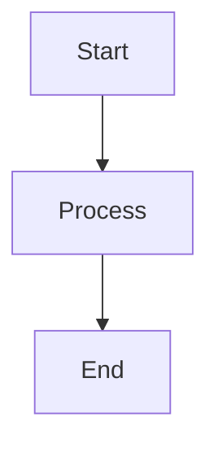

# CLAUDE.md

This file provides guidance to Claude Code (claude.ai/code) when working with code in this repository.

## Repository Overview

This is a course repository for ITAM's Artificial Intelligence class (Primavera 2026). It contains course materials, guides, and student assignments. The site is built using **uu_framework**, a custom static site generator based on Eleventy.

## Repository Structure

```
ia_p26/
├── clase/              # Course content (rendered to site); includes flow.sh
├── estudiantes/        # Student work (not rendered)
├── uu_framework/       # Static site framework (config/, scripts/, eleventy/, docker/, docs/)
├── _site/              # Built output (gitignored)
└── CLAUDE.md           # This file
```

## uu_framework Architecture

### Build Pipeline

The build process runs in three sequential phases:

```
Phase 1: Python Preprocessing (scripts/preprocess.py)
   ├── generate_landing_page()     → clase/README.md (from root README.md)
   ├── extract_metadata.py          → _data/metadata.json (frontmatter + file info)
   ├── generate_indices.py          → _data/hierarchy.json (nav tree structure)
   ├── aggregate_tasks.py           → _data/tasks.json (homework/exams/projects)
   └── process_calendar_topics.py   → _data/calendar_topics.json

Phase 2: Eleventy Build (.eleventy.js)
   ├── Loads JSON data from _data/
   ├── Parses markdown (markdown-it + plugins)
   │   ├── markdown-it-container  → :::homework, :::exercise, etc.
   │   ├── markdown-it-attrs      → {.class #id} syntax
   │   └── markdown-it-anchor     → heading anchors
   ├── Renders with Nunjucks templates (_includes/)
   ├── Copies static assets (images, PDFs, fonts)
   └── Outputs to _site/

Phase 3: Tailwind CSS (tailwind.config.js)
   ├── Processes src/css/main.css
   ├── Copies theme files (src/css/themes/*.css)
   └── Outputs to _site/css/
```

### Key Architecture Concepts

**Data Flow**: Python scripts extract data from markdown frontmatter and content, generating JSON files that Eleventy templates consume via the `_data/` directory. This separation allows content changes to trigger minimal rebuilds.

**Content Exclusions**: Files matching patterns in `uu_framework/config/site.yaml` (like `b_libros/`, `flow.sh`, `??_*` directories) are excluded from rendering but may still be present in the repository.

**Docs Path**: `uu_framework/docs/` content renders to `/docs/` on the site (separate from the `clase/` hierarchy). Handled by `generate_docs_hierarchy()` in preprocessing.

**Path Prefix**: Auto-detected from git remote (e.g., `/ia_p26/`). The framework reads the repository name from `git config --get remote.origin.url` during preprocessing and generates `repo.json`, which Eleventy uses for URL prefixing. Configurable via `site.yaml` or `PATH_PREFIX` environment variable.

### File Naming Convention

| Pattern | Meaning | Example |
|---------|---------|---------|
| `00_*.md` | Index file | `00_index.md` |
| `01_`, `02_` | Chapters (ordered) | `01_intro/` |
| `a_`, `b_` | Appendices | `a_stack/` |
| `??_*` | Work-in-progress (hidden) | `??_draft/` |

### Markdown Components

Use container syntax for special content blocks:

```markdown
:::homework{id="hw-01" title="Task Name" due="2026-02-01" points="10"}
Assignment instructions...
:::

:::exercise{title="Exercise Title"}
Exercise steps...
:::

:::prompt{title="LLM Prompt"}
Prompt text to copy...
:::

:::example{title="Example"}
Example content...
:::

:::exam{id="exam-01" title="Exam Name" date="2026-03-15"}
Exam information...
:::

:::project{id="proj-01" title="Project Name" due="2026-05-15"}
Project description...
:::
```

### Mermaid Diagrams

Mermaid diagrams are auto-rendered:

````markdown

````

## Key Commands

### Docker Build Commands (recommended)

All Docker commands must be run from the repository root:

```bash
# Start dev server with hot reload (most common)
docker compose -f uu_framework/docker/docker-compose.yaml up dev
# → Runs preprocessing, builds site, starts BrowserSync at http://localhost:3000/ia_p26/
# → Watches for file changes and auto-rebuilds

# Production build (for deployment)
docker compose -f uu_framework/docker/docker-compose.yaml run build

# Debug preprocessing only
docker compose -f uu_framework/docker/docker-compose.yaml run preprocess
```

### Local Build Commands (without Docker)

Requires Node.js >=18 and Python 3 with `pyyaml`. CI uses **Node 20** and **Python 3.12**; match these locally to avoid version mismatches.

```bash
# Install Node dependencies (one time)
cd uu_framework/eleventy && npm install && cd ../..

# Phase 1: Preprocessing
python3 uu_framework/scripts/preprocess.py --verbose

# Phase 2: Eleventy build
./uu_framework/eleventy/node_modules/.bin/eleventy --config=uu_framework/eleventy/.eleventy.js

# Phase 3: Tailwind CSS
mkdir -p _site/css/themes
./uu_framework/eleventy/node_modules/.bin/tailwindcss -c uu_framework/eleventy/tailwind.config.js -i uu_framework/eleventy/src/css/main.css -o _site/css/styles.css --minify
cp uu_framework/eleventy/src/css/themes/*.css _site/css/themes/
```

### Git Workflow Script (flow.sh)

Student-focused wrapper for common Git operations:

```bash
./clase/flow.sh setup              # Configure upstream remote + create user folder
./clase/flow.sh sync               # Pull from upstream/main → push to origin/main
./clase/flow.sh start <task-name>  # Sync + create new branch from main
./clase/flow.sh save "message"     # Stage all + commit with message
./clase/flow.sh upload             # Push current branch to origin
./clase/flow.sh finish             # Return to main, sync, optionally delete branch
./clase/flow.sh copy <src> <dest>  # Copy files with safety checks
```

**Upstream repository**: Auto-detected from git remote (for this repo: `git@github.com:sonder-art/ia_p26.git`)
**Student workflow**: Work in `estudiantes/<username>/`, commit to feature branches, push to personal forks, create PRs to upstream.

## CI/CD

- **Deployment** (`deploy.yaml`): Push to `main` triggers full build → deploy to GitHub Pages at `https://www.sonder.art/ia_p26/`
- **Student PR validation** (`student-pr-validation.yml`): Ensures student PRs only modify files under `estudiantes/<username>/`. Bypasses for `uumami` and repo owner.
- **Claude Code** (`claude.yml`): Responds to `@claude` mentions in issues, PR comments, and PR reviews via `anthropics/claude-code-action@v1`.

## Development Guidelines

### When Modifying the Framework

Key files to understand when making framework changes:

1. **Eleventy config** (`uu_framework/eleventy/.eleventy.js`):
   - Custom markdown-it containers (:::homework, :::exercise, etc.)
   - Filters: `formatDate`, `renderMarkdown`, `getNavNumber`, `cleanNavTitle`
   - Collections: content filtering logic, exclusions
   - Transforms: `.md` link rewriting
   - Passthrough copy rules for PDFs, images, fonts

2. **Templates** (`uu_framework/eleventy/_includes/`):
   - `layouts/base.njk`: Main page wrapper
   - Navigation components consume `hierarchy.json`
   - Task pages consume `tasks.json`

3. **Preprocessing** (`uu_framework/scripts/`):
   - `preprocess.py`: Orchestrator that runs all extractors
   - Modify extractors to change what data is available to templates
   - JSON outputs land in `_data/` for Eleventy consumption
   - `calendario_temas.csv` in `clase/` feeds into `calendar_topics.json` (DD/MM/YYYY format)

4. **Configuration** (`uu_framework/config/site.yaml`):
   - Exclusion patterns, theme settings, feature flags
   - Changes here require preprocessing rerun

### When Creating Content

1. **Follow file naming convention** for proper ordering (see table above)
2. **Use YAML frontmatter** with these fields:
   - `title` (required) - Page title
   - `summary` - Short description shown in navigation
   - `order` - Override default sort order (optional)
   - `date` - For exam/task components
   - `layout` - Template: `layouts/base.njk` (default), `layouts/chapter.njk` (sections with task summaries), `layouts/index.njk` (auto-generated TOC for subsections), `layouts/task-list.njk` (aggregated task pages)
   - `showSidebar` - Control sidebar visibility (true/false)
   - `permalink` - Custom URL override
3. **Use component syntax** for assignments (see Markdown Components section above)
4. **Markdown links**: Write as `[text](../path/file.md)` - Eleventy transforms to `[text](../path/file/)` automatically
5. **Images**: Place in nearest `images/` directory, reference using Nunjucks template syntax with the `url` filter:
   ```markdown
   
   ```
   **Do NOT use relative paths** like `images/file.png` — Eleventy converts each `.md` to a directory with `index.html`, breaking relative image references.

### Language Guidelines

- **Framework code & dev docs**: English
- **Course content & user guides**: Spanish
- **Comments in code**: English preferred

### Module Structure

Each module in `clase/` follows this internal pattern:

```
NN_module_name/
├── 00_index.md          # Chapter index (may contain :::homework or :::exam blocks)
├── 01_topic.md          # Numbered content pages
├── images/              # Generated by lab_*.py scripts
├── lab_*.py             # Image generation script (modules 05-08)
├── notebooks/           # Jupyter notebooks for exercises/homework
├── ejercicios/          # Exercise subdirectory
├── code/ or it_code/    # Python utilities (excluded from site rendering)
├── datasets/            # Data files (excluded from site rendering)
└── requirements.txt     # Per-module pip dependencies (no global requirements file)
```

Active modules: `01_introduccion`, `02_agentes_&_ambientes` (note ampersand — quote in shell), `03_logica`, `04_computabilidad_complejidad`, `05_probabilidad`, `06_teoria_de_la_informacion`, `07_optimization`, `08_prediccion`. Appendix: `a_stack`.

### Lab Scripts (`lab_*.py`)

All lab scripts follow an identical pattern (see any `lab_*.py` for reference):

- `plt.style.use("seaborn-v0_8-whitegrid")` + shared `COLORS` dict + `plt.rcParams` overrides
- `ROOT = Path(__file__).resolve().parent`, `IMAGES_DIR = ROOT / "images"`
- `np.random.seed(42)` for reproducibility
- `_save(fig, name)` helper (dpi=160, bbox_inches="tight")
- One function per plot, `main()` calls all, `if __name__ == "__main__": main()`
- **Must run from the module directory**: `cd clase/08_prediccion && python lab_prediccion.py`
- Dependencies: `numpy`, `matplotlib`, `scipy` (module 06 also imports from its local `it_code/` package)

## Gotchas

- **Preprocessing required first**: Always run preprocessing before Eleventy. The build will fail if `repo.json` doesn't exist (auto-detected from git remote). If you see "Cannot determine path prefix", run preprocessing first.
- **`_data/*.json` files are gitignored**: `metadata.json`, `hierarchy.json`, `tasks.json`, `calendar_topics.json`, `repo.json` are all generated by preprocessing and won't exist in a fresh clone. Run preprocessing to generate them.
- **`clase/README.md` is auto-generated**: Preprocessing copies root `README.md` → `clase/README.md` (with URL transformations). Never edit `clase/README.md` directly; edit the root `README.md` instead.
- **Content exclusions**: `??_` prefixed directories are work-in-progress and excluded from build. `b_libros/` is gitignored.
- **Solution files gitignored**: `*_SOLUCION.ipynb` files are excluded from version control to prevent distributing homework solutions.
- **Markdown links**: Use `.md` extension in links (e.g., `[text](../file.md)`). Eleventy transforms them to directory URLs automatically.
- **Math is rendered client-side by KaTeX**: Math is NOT processed by markdown-it server-side. KaTeX auto-render runs in the browser (configured in `base.njk`). All math must be wrapped in delimiters: `$...$` for inline, `$$...$$` for display. Bare expressions like `P(Y|X)` will NOT render — write `$P(Y \mid X)$` instead.
- **Math `|` in tables breaks columns**: Inside markdown table cells, `|` is the column separator. Use `\mid` for conditional probability: `$P(Y \mid X)$` not `$P(Y|X)$`. The `\|` escape renders as `‖` (double bar) in KaTeX.
- **Math rendering with `\ast`**: `\ast` in LaTeX math breaks when markdown-it processes it — the `*` inside gets interpreted as markdown emphasis. Use Unicode `∗` (U+2217, ASTERISK OPERATOR) instead: `x^{∗}` not `x^{\ast}`. Similarly, use `&#36;` instead of `$` for currency to avoid math delimiter conflicts.
- **Calendar CSV date format**: `clase/calendario_temas.csv` uses **DD/MM/YYYY** input format. Preprocessing converts to ISO (YYYY-MM-DD). Easy to mix up.
- **`formatDate` filter uses Mexico City timezone**: Dates use `es-MX` locale with `America/Mexico_City` timezone. The filter appends `T12:00:00` to date strings to avoid timezone-shift issues.
- **Dev server port**: Docker dev server uses BrowserSync on port **3000** (not the Eleventy default 8080).
- **Asset copying is multi-layered**: Images/PDFs are copied by Docker compose commands (dev), GitHub Actions (prod), and Eleventy passthrough. Changes to asset copy logic may need updating in multiple places.
- **`flow.sh` depends on `repo.json`**: It reads `repo.json` for upstream URL detection. Run preprocessing first or ensure `repo.json` exists.
- **No test suite or linter**: The framework has no tests or linting configuration. Validate changes by running the dev server.
