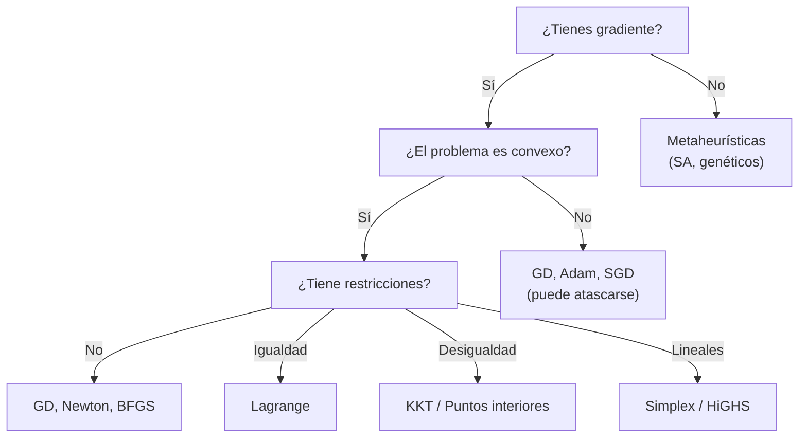

# Algoritmos de optimización: intuiciones

Esta sección da una vista panorámica de los algoritmos más importantes. No vamos a derivar nada formalmente — la meta es construir **intuición** sobre cuándo y por qué funciona cada método.

---

## Descenso de gradiente (sin restricciones)

La idea más simple y poderosa: **camina cuesta abajo**.

$$x_{k+1} = x_k - \alpha \nabla f(x_k)$$

donde $\alpha > 0$ es el **learning rate** (tasa de aprendizaje).

### Intuición

- $\nabla f(x_k)$ apunta en la dirección de **mayor crecimiento** de $f$.
- El negativo $-\nabla f(x_k)$ apunta "cuesta abajo".
- $\alpha$ controla el tamaño del paso.

### El learning rate importa mucho

| $\alpha$ muy pequeño | $\alpha$ muy grande |
|---|---|
| Convergencia lenta pero segura | Puede divergir (oscilar o explotar) |
| Muchos pasos para llegar | Pocos pasos pero inestable |

En la práctica, se usan variantes que adaptan $\alpha$ automáticamente:
- **SGD** (Stochastic Gradient Descent): usa un subconjunto (mini-batch) de datos para estimar el gradiente. Más ruidoso pero mucho más rápido por iteración.
- **Adam**: adapta el learning rate por parámetro usando momentos del gradiente. Es el optimizador por defecto en deep learning moderno.

---

## Multiplicadores de Lagrange (restricciones de igualdad)

¿Cómo minimizas $f(x)$ cuando $x$ debe estar sobre una superficie $h(x) = 0$?

**Intuición geométrica:** en el óptimo, el gradiente de $f$ es **paralelo** al gradiente de $h$. Si no fueran paralelos, podrías moverte a lo largo de la restricción y seguir bajando.

$$\nabla f(x^*) = \lambda \nabla h(x^*)$$

Esto se formaliza con el **Lagrangiano**:

$$\mathcal{L}(x, \lambda) = f(x) + \lambda \, h(x)$$

El óptimo se encuentra resolviendo $\nabla_x \mathcal{L} = 0$ y $\nabla_\lambda \mathcal{L} = 0$ (que equivale a $h(x) = 0$).

### Ejemplo trabajado

$\min \quad x^2 + y^2 \quad$ sujeto a $\quad x + y = 1$

Lagrangiano: $\mathcal{L}(x, y, \lambda) = x^2 + y^2 + \lambda(x + y - 1)$

<strong>Ver Solución</strong>

Condiciones de primer orden:

$$
\begin{aligned}
\frac{\partial \mathcal{L}}{\partial x} &= 2x + \lambda = 0 \quad \Rightarrow \quad x = -\lambda/2 \\
\frac{\partial \mathcal{L}}{\partial y} &= 2y + \lambda = 0 \quad \Rightarrow \quad y = -\lambda/2 \\
\frac{\partial \mathcal{L}}{\partial \lambda} &= x + y - 1 = 0
\end{aligned}
$$

De las dos primeras: $x = y$. Sustituyendo en la tercera: $2x = 1 \Rightarrow x = y = 1/2$.

Solución: $(x^*, y^*) = (1/2, 1/2)$, con $f^* = 1/2$.

**Conexión con módulo 06:** Los multiplicadores de Lagrange aparecen también en la derivación de la distribución de máxima entropía (MaxEnt de Jaynes). Allí, maximizas entropía sujeto a restricciones de momentos — exactamente la misma estructura.

---

## Condiciones KKT (restricciones de desigualdad)

Las condiciones de **Karush-Kuhn-Tucker** extienden Lagrange a restricciones de desigualdad $g_j(x) \leq 0$.

**Intuición:** "Lagrange + restricciones activas/inactivas".

El Lagrangiano generalizado es:

$$\mathcal{L}(x, \lambda, \mu) = f(x) + \sum_i \lambda_i h_i(x) + \sum_j \mu_j g_j(x)$$

Las condiciones KKT agregan una condición clave — **holgura complementaria**:

$$\mu_j \, g_j(x) = 0 \quad \text{para todo } j$$

Esto dice: para cada restricción de desigualdad, o la restricción está **activa** ($g_j = 0$, y $\mu_j$ puede ser positivo) o está **inactiva** ($g_j < 0$, y $\mu_j = 0$, "no importa"). Nunca ambas.

No vamos a derivar KKT formalmente, pero es importante saber que **existen** y que son la base teórica de muchos solvers.

---

## Método simplex (programación lineal)

Para problemas lineales ($\min c^T x$ sujeto a $Ax \leq b$, $x \geq 0$), hay una estructura especial:

- La **región factible** es un **politopo** (poliedro acotado).
- El **óptimo siempre está en un vértice** del politopo.

El **método simplex** (Dantzig, 1947) camina de vértice en vértice, siempre mejorando el objetivo, hasta llegar al óptimo. Es extraordinariamente eficiente en la práctica, aunque teóricamente puede ser exponencial en el peor caso.

---

## Metaheurísticas: cuando no hay gradiente

A veces no puedes (o no quieres) calcular gradientes: la función es ruidosa, discontinua, o de caja negra. Ahí entran las **metaheurísticas**:

**Simulated annealing** (recocido simulado): Inspirado en metalurgia. Acepta soluciones peores con probabilidad decreciente (controlada por una "temperatura" que baja con el tiempo). Esto permite escapar de mínimos locales al inicio y refinar al final.

**Algoritmos genéticos**: Inspirados en evolución. Mantienen una "población" de soluciones candidatas, las combinan (crossover), mutan, y seleccionan las mejores. Útiles cuando el espacio de búsqueda es combinatorio o discreto.

---

## Taxonomía de algoritmos

---

:::exercise{title="Ejercicio: Empareja algoritmo con problema" difficulty="1"}

Empareja cada problema con el algoritmo más apropiado:

| Problema | Algoritmo |
|----------|-----------|
| 1. $\min c^T x$ s.t. $Ax \leq b$ | a. Descenso de gradiente |
| 2. Entrenar una red neuronal | b. Simplex |
| 3. $\min f(x)$ s.t. $h(x) = 0$, $f$ y $h$ diferenciables | c. Simulated annealing |
| 4. Optimizar una función de caja negra ruidosa | d. Multiplicadores de Lagrange |

<strong>Ver Solución</strong>

1 → b (Simplex: problema lineal)
2 → a (Descenso de gradiente / SGD / Adam: sin restricciones, con gradiente)
3 → d (Lagrange: restricción de igualdad, diferenciable)
4 → c (Simulated annealing: sin gradiente, función de caja negra)

:::

---

**Siguiente:** [Ejemplos en Python →](04_ejemplos_python.md)
