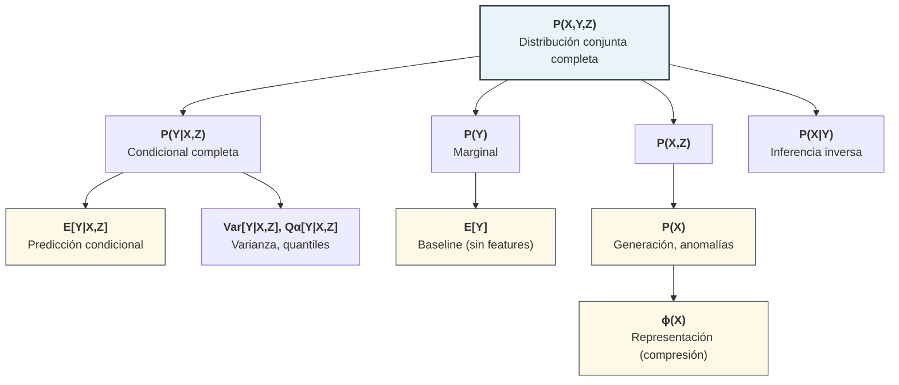
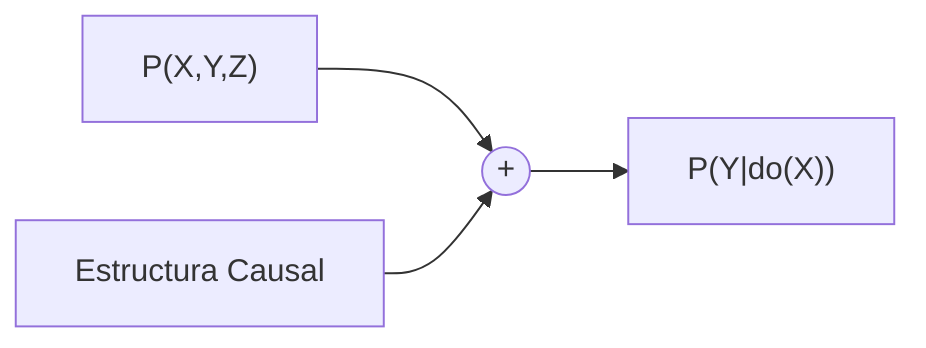

# El Problema Fundamental de la Predicción

> *"Knowing the future can be a kind of imprisonment."*
> — Paul Atreides, Dune

Predecir es un problema fundamental en IA, pero no lo es todo, solo es una parte del proceso que puede ayudar a los agentes a entender el mundo. *¿De dónde viene el conocimiento? ¿Qué significa la incertidumbre? ¿Qué queremos realmente del modelo?*

Empecemos por entender la estructura.

---

## ¿Qué es predecir?

En su forma más general, **predecir** es estimar alguna cantidad desconocida a partir de información disponible.

**Notación**:

| Símbolo | Significado |
|---------|-------------|
| **Y** | Variable objetivo (lo que queremos predecir) |
| **X** | Variables observables / features |
| **Z** | Información auxiliar observable / proxies |
| **L** | Variable latente (no observada, inferida por el modelo) |
| **C** | Cluster o categoría discreta |
| **θ** | Parámetros del modelo |

## El objetivo matemático

Dependiendo del contexto, podemos querer estimar diferentes cantidades. Cada una responde a una pregunta diferente.

**Nota importante sobre la notación:**
En estas notas usamos **E[·]** (valor esperado/media) como el estadístico principal por ser el más común en la práctica. Sin embargo, formalmente podríamos querer estimar **cualquier funcional o estadístico** de la distribución:

| Estadístico | Notación | Cuándo usarlo |
|-------------|----------|---------------|
| **Media** | E[Y\|X] | Predicción puntual, minimiza MSE |
| **Mediana** | Q₀.₅[Y\|X] | Robusto a outliers, minimiza MAE |
| **Quantiles** | Qα[Y\|X] | Riesgo (VaR), intervalos de predicción |
| **Varianza** | Var[Y\|X] | Incertidumbre, volatilidad |
| **Moda** | Mode[Y\|X] | Valor más probable |

Donde dice **E[Y\|X]**, léase como "un estadístico de Y dado X" — la media es simplemente el caso más frecuente.

| Objetivo | Notación | Descripción |
|----------|----------|-------------|
| Distribución marginal de Y | **P(Y)** | Distribución de Y sin condicionar en nada |
| Media incondicional | **E[Y]** | Solo la media de Y (el baseline más simple) |
| Distribución condicional completa | **P(Y\|X,Z)** | Toda la forma de la distribución de Y dado X y Z |
| Valor esperado condicional | **E[Y\|X,Z]** | Solo la media de Y dado X y Z |
| Distribución de los datos | **P(X)** o **P(X,Z)** | La densidad de los inputs (sin objetivo) |
| Representación | **ϕ(X) → ℝᵈ** | Un embedding o compresión de X |
| Efecto causal | **P(Y\|do(X))** | El resultado de *intervenir* en X |

## Explicación de cada objetivo

**P(Y) — Distribución marginal**
> "¿Cómo se distribuye Y en general, sin saber nada más?"

Es la distribución de Y ignorando cualquier información de X o Z. Es el punto de partida: si no conoces ningún feature, ¿qué puedes decir de Y?

:::example{title="S&P 500"}
Distribución de retornos diarios del S&P 500. Sin saber nada del contexto (qué día es, qué pasó en el mercado), ¿cuál es la probabilidad de un retorno de +2%? La respuesta está en P(Y).
:::

---

**E[Y] — Media incondicional (el baseline)**
> "¿Cuál es el promedio histórico de Y?"

Es el predictor más simple posible cuando no tienes features. **Todo modelo más complejo debe superar este baseline** para justificar su complejidad.

**Nota**: El "mejor" estadístico incondicional depende de la función de pérdida:

| Si minimizas... | El baseline óptimo es... | Notación |
|-----------------|-------------------------|----------|
| Error cuadrático (MSE) | **Media** | E[Y] |
| Error absoluto (MAE) | **Mediana** | Q₀.₅[Y] |
| Pérdida asimétrica | **Quantil** correspondiente | Qα[Y] |

:::example{title="Precio de casa"}
"El precio promedio de una casa es &#36;300,000". Si tu modelo sofisticado con 50 features no supera esta predicción naive, algo está mal. E[Y] es el piso mínimo de performance (para MSE).
:::

---

**P(Y|X) — Distribución condicional completa**
> "Dado que observo X, ¿cuál es la distribución completa de posibles valores de Y?"

No solo te dice el valor más probable, sino toda la forma: ¿es simétrica? ¿tiene colas pesadas? ¿es multimodal? Esto es crucial cuando necesitas cuantificar incertidumbre.

:::example{title="Pronóstico del clima"}
No solo "mañana habrá 20°C", sino la distribución completa: 10% probabilidad de <15°C, 60% de 18-22°C, 30% de >22°C.
:::

---

**E[Y|X] — Valor esperado (media condicional)**
> "Dado que observo X, ¿cuál es el valor promedio esperado de Y?"

Es un solo número — el "mejor guess" en sentido de mínimo error cuadrático. Pierdes información sobre variabilidad.

:::example{title="Predicción de precio"}
El modelo dice "&#36;250,000" — un número, no una distribución.
:::

---

**Nota sobre series de tiempo:**

Las series de tiempo son un caso especial donde los features X son la **historia de la misma variable Y**:
- P(Y_{t+1} | Y_t, Y_{t-1}, ...) es P(Y|X) donde X = {Y_t, Y_{t-1}, ...} (pero con diferentes supuestos)
- Modelos como AR, ARIMA, LSTM, y Transformers temporales usan esta estructura
- El baseline **E[Y]** sigue siendo relevante: un modelo temporal que no supere "predecir la media histórica" no aporta valor
- También existe el baseline "naive" de series de tiempo: predecir Y_{t+1} = Y_t (el último valor observado)

**La propiedad de Markov (memorylessness):**

Una simplificación poderosa es asumir que **solo el presente importa**:
- **P(Y_{t+1} | Y_t, Y_{t-1}, ...) = P(Y_{t+1} | Y_t)** ← Propiedad de Markov
- "El futuro es independiente del pasado dado el presente"
- Reduce drásticamente la complejidad: de historia infinita a un solo estado
- Es un supuesto **deductivo/híbrido**: decides a priori que la historia lejana es irrelevante
- Modelos: Cadenas de Markov, Hidden Markov Models (HMM), filtros de Kalman

---

**P(X) — Distribución de los datos**
> "¿Cuál es la probabilidad de observar este input X?"

No hay variable objetivo Y. Modelas cómo se distribuyen los datos en sí mismos.

:::example{title="Detección de fraude"}
Si P(transacción) es muy baja, la transacción es "rara" → posible fraude.
:::

---

**ϕ(X) → ℝᵈ — Representación (embedding)**
> "¿Cómo puedo comprimir X en un vector de dimensión menor que capture su esencia?"

Es una función determinista que mapea inputs a un espacio de menor dimensión. No es probabilístico.

:::example{title="Word2Vec"}
Convierte palabras en vectores de 300 dimensiones donde "rey - hombre + mujer ≈ reina".
:::

---

**P(Y|do(X)) — Efecto causal (intervención)**
> "Si yo CAMBIO X activamente, ¿qué pasa con Y?"

Es diferente de P(Y|X) que solo pregunta "si OBSERVO X". La diferencia es crucial:
- P(Y|X): "Las personas que toman aspirina tienen menos infartos" (correlación)
- P(Y|do(X)): "Si le DOY aspirina a alguien, ¿tendrá menos infartos?" (causación)

:::example{title="Heladerías y crimen"}
Si observas que ciudades con más heladerías tienen más crimen, P(crimen|heladerías) es alto. Pero P(crimen|do(cerrar heladerías)) no baja el crimen — ambos son causados por el calor.
:::

## Jerarquía de generalidad

**¿Y el efecto causal P(Y|do(X))?**

P(Y|do(X)) **NO** se deriva de P(X,Y) directamente. Requiere información adicional: estructura causal (un DAG) que te dice qué variables causan qué.

**Regla clave**: Si conoces una cantidad más general (arriba), puedes derivar las más específicas (abajo). No al revés. Más información siempre puede comprimirse; menos información no puede expandirse.

**¿Por qué ϕ(X) está "debajo" de P(X)?**
- De P(X) puedes derivar muchas representaciones ϕ(X) (ej: los modos de la distribución, componentes principales)
- De ϕ(X) no puedes recuperar P(X) — perdiste información al comprimir

**¿Por qué P(Y|do(X)) está separado?**
- No puedes derivar efectos causales solo de datos observacionales P(X,Y)
- Necesitas supuestos adicionales sobre la estructura causal
- Por eso causalidad requiere más que solo "más datos"

**¿Por qué E[Y] importa como baseline?**

E[Y] es el **baseline universal** contra el que todo modelo predictivo debe compararse:
- Si tu modelo E[Y|X] no mejora sobre predecir E[Y] siempre, los features X no aportan información útil
- En ML esto se mide con métricas como **R²** (qué porcentaje de varianza explica el modelo sobre el baseline)
- Un R² de 0 significa: "mi modelo sofisticado no es mejor que predecir la media"
- Un R² negativo significa: "mi modelo es PEOR que predecir la media" (sobreajuste o error)

La pregunta fundamental antes de construir cualquier modelo complejo es: **¿Mis features X realmente ayudan a predecir Y mejor que simplemente usar E[Y]?** Si la respuesta es no, el modelo más sofisticado del mundo no te salvará.

Por ejemplo:
- De **P(Y|X)** puedes calcular **E[Y|X] = ∫ y · P(y|X) dy**
- De **E[Y|X]** **no puedes** recuperar **P(Y|X)** (perdiste información sobre varianza, forma, etc.)

## El problema fundamental: Restricción

> *"The future is always a surprise to those who look too far ahead."*
> — Children of Dune

Imagina que tienes tres puntos en un plano y quieres trazar la curva que los conecta. ¿Cuál eliges? Podría ser una línea recta. Podría ser una parábola. Podría ser una onda sinusoidal. Podría ser un garabato que pasa exactamente por los tres puntos y luego hace piruetas absurdas.

Matemáticamente, **todas son válidas**. Los datos — esos tres puntos — no te dicen cuál es "la correcta".

Esta es la paradoja central de la predicción: los datos nunca son suficientes. Siempre necesitas algo más — un supuesto, una creencia, una restricción sobre qué curvas son "razonables". Cada método de predicción es, en el fondo, una respuesta diferente a esta pregunta: *¿qué formas del mundo consideras plausibles?*

**El dilema formal**:
- Tenemos **datos finitos** (N observaciones)
- El espacio de funciones posibles es **infinito**
- Hay infinitos modelos que ajustan perfectamente los datos de entrenamiento

**Consecuencia**:
Todo método de predicción es una forma de **restringir el espacio de hipótesis**. Las diferencias entre métodos son diferencias en:
1. **Qué restricciones** imponen
2. **De dónde vienen** esas restricciones
3. **Cómo se expresan** matemáticamente

De los datos viene el ajuste. De la teoría viene la estructura. De la restricción viene la generalización.

Esta es la base de nuestra taxonomía.

---

Ahora que entendemos qué significa predecir y por qué necesitamos restringir nuestras hipótesis, podemos preguntarnos: ¿cuáles son las decisiones fundamentales que definen cualquier método de predicción?

**Siguiente:** [Fuente del conocimiento (D1) →](02_fuente_del_conocimiento.md)
