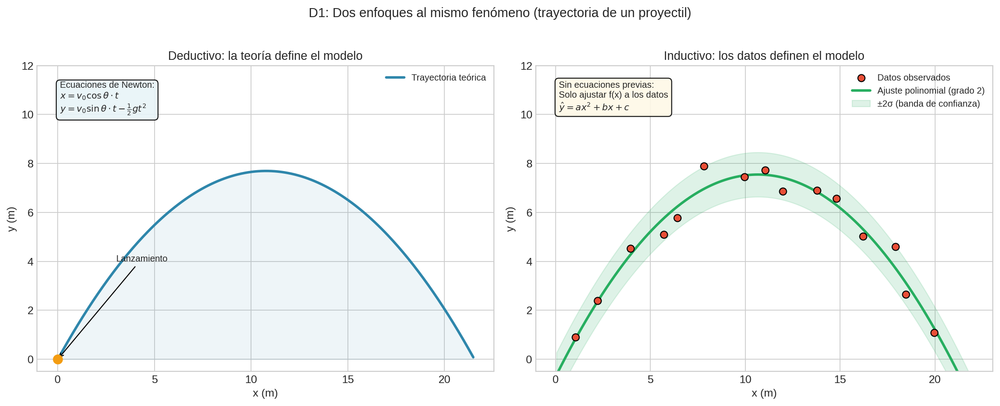
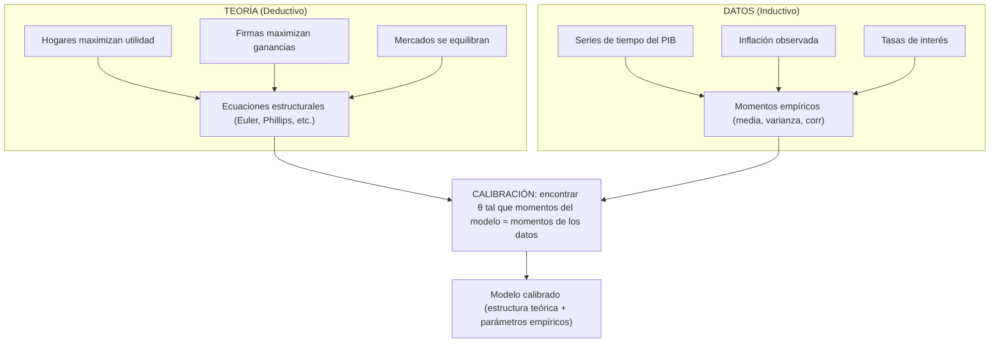
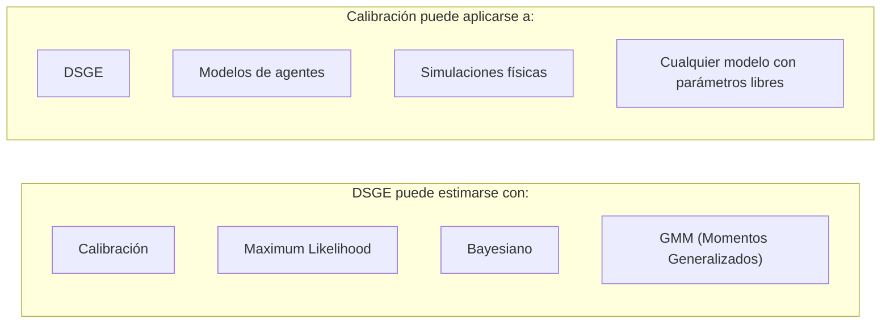

# D1: Fuente del Conocimiento Estructural

## Las 5 Dimensiones Ortogonales

No existe UNA forma correcta de categorizar los métodos de predicción. Pero existe una forma *útil*: pensar en **5 ejes independientes** que caracterizan cualquier enfoque. Cada método es un punto en este espacio 5-dimensional. La magia desaparece cuando puedes nombrar las coordenadas.

```
Método = (D1: Fuente del Conocimiento Estructural,
          D2: Interpretación de Probabilidad,
          D3: Objetivo Matemático,
          D4: Arquitectura de Variables,
          D5: Supuesto Inductivo)
```

Las dimensiones son **ortogonales**: puedes elegir cualquier combinación de opciones en cada eje. Un método deductivo puede ser bayesiano o frequentist. Un método inductivo puede tener arquitectura causal o plana. Las combinaciones son (casi) libres.

---

## Dimensión 1: Fuente del Conocimiento Estructural

> *"In theory, theory and practice are the same. In practice, they are not."*

*Antes de los datos, está la pregunta: ¿qué sabes ya?*

**Pregunta clave**: *"¿De dónde viene la estructura del modelo?"*

Hay dos caminos para saber algo del mundo. El primero dice: *pienso, luego predigo*. El segundo dice: *observo, luego generalizo*. Esta es quizás la dimensión más fundamental. Antes de hablar de algoritmos o matemáticas, debemos preguntarnos: ¿qué **sabemos** (o creemos saber) sobre el problema antes de ver los datos?

| Tipo | Descripción | Ejemplos | Situación real |
|------|-------------|----------|----------------|
| **Deductivo** | La estructura viene de teoría/axiomas previos a los datos | Modelos físicos, DSGE en economía, sistemas expertos | *Simulación de vuelo*: ecuaciones de aerodinámica definen el modelo, datos solo validan |
| **Inductivo** | La estructura emerge de patrones en los datos | ML clásico, Deep Learning, clustering | *Recomendador de Netflix*: no hay "teoría de gustos", solo patrones en millones de usuarios |
| **Híbrido** | Teoría provee esqueleto, datos ajustan parámetros | Calibración económica, Physics-Informed NNs, Bayesian con priors informativos | *Modelo macroeconómico*: teoría dice que consumo depende de ingreso esperado, datos calibran elasticidades |

---



### Enfoque Deductivo: "La teoría primero"

En el enfoque deductivo, **la estructura del modelo existe antes de ver cualquier dato**. Viene de:
- Leyes físicas (Newton, Maxwell, termodinámica)
- Axiomas económicos (optimización de agentes, equilibrio de mercados)
- Lógica formal (reglas de inferencia, ontologías)

**Flujo deductivo:**


**Características:**
- El modelo puede existir sin datos (ej: ecuaciones de Einstein existían antes de confirmarlas)
- Los datos sirven para **validar** o **refutar**, no para descubrir estructura
- Alta interpretabilidad: cada término tiene significado teórico
- Puede fallar si la teoría está equivocada

:::example{title="Física — Navier-Stokes"}
Las ecuaciones de Navier-Stokes describen fluidos. No las "aprendimos" de datos — las derivamos de principios de conservación (masa, momento, energía). Un simulador de clima usa estas ecuaciones; los datos solo calibran condiciones iniciales.
:::

:::example{title="Economía — DSGE"}
Un modelo DSGE parte de supuestos: hogares maximizan utilidad, firmas maximizan ganancias, mercados se equilibran. De estos axiomas se derivan ecuaciones (Euler, Phillips). La estructura está fijada; los datos solo determinan valores de parámetros como elasticidades.
:::

---

### Enfoque Inductivo: "Los datos primero"

En el enfoque inductivo, **la estructura emerge de los patrones en los datos**. No hay teoría previa que dicte la forma funcional.

**Flujo inductivo:**


**Características:**
- Sin datos, no hay modelo
- El modelo "descubre" relaciones que no conocíamos
- Puede encontrar patrones no lineales, interacciones complejas
- Riesgo: puede encontrar patrones espurios (correlación sin causación)
- Menor interpretabilidad: ¿qué significa el peso 0.73 en la capa 5?

:::example{title="Recomendador de Netflix"}
No existe una "teoría de gustos cinematográficos" que diga que si te gusta X, te gustará Y. El sistema observa millones de usuarios, encuentra patrones (gente que vio A también vio B), y los explota. La estructura (qué factores importan) emerge de los datos.
:::

:::example{title="Reconocimiento de imágenes"}
No hay axiomas que digan "un gato tiene orejas puntiagudas y bigotes". La red neuronal ve millones de imágenes etiquetadas y aprende features discriminativas. Nadie programó qué buscar.
:::

---

### Enfoque Híbrido: "Lo mejor de ambos mundos"

El enfoque híbrido combina conocimiento teórico con aprendizaje de datos. La teoría provee el **esqueleto**, los datos ajustan los **detalles**.

**Flujo híbrido:**


**Variantes del enfoque híbrido:**

| Variante | Qué provee la teoría | Qué proveen los datos |
|----------|---------------------|----------------------|
| **Calibración** | Forma funcional completa | Valores de parámetros |
| **Physics-Informed NN** | Restricciones (ej: conservación de energía) | Función de aproximación |
| **Priors informativos** | Distribución a priori sobre parámetros | Actualización posterior |
| **Modelos semi-paramétricos** | Parte paramétrica (teoría) | Parte no-paramétrica (datos) |

:::example{title="Calibración económica"}
Un modelo macroeconómico tiene la forma: `C = f(Y, r, θ)` donde:
- La teoría dice que Consumo (C) depende de Ingreso (Y) y tasa de interés (r)
- La forma funcional f viene de optimización de hogares
- Pero el parámetro θ (elasticidad) no lo dice la teoría
- Los datos determinan θ mediante match de momentos (ej: ajustar para que el modelo reproduzca la volatilidad observada del PIB)
:::

:::example{title="Physics-Informed Neural Networks"}
Quieres predecir el flujo de calor en un material. Sabes que debe satisfacer la ecuación de calor (∂T/∂t = α∇²T). En lugar de solo minimizar error de predicción, agregas un término al loss que penaliza violar la ecuación. La red aprende una función que:
1. Ajusta los datos observados
2. Respeta la física conocida
:::

---

### El caso de la calibración económica (expandido)

La calibración es el ejemplo canónico de enfoque híbrido en ciencias sociales:



La teoría te dice *qué* variables se relacionan y *cómo* (funcionalmente). Los datos te dicen los *valores numéricos* de los parámetros.

**Nota importante: DSGE vs Calibración**

Es común confundir estos términos porque suelen aparecer juntos, pero son cosas distintas:

| Concepto | ¿Qué es? | Dimensión |
|----------|----------|-----------|
| **DSGE** | Un **tipo de modelo** (estructura basada en teoría micro: agentes optimizando, equilibrio general) | D1 (Deductivo) + D4 (Arquitectura de grafo/ecuaciones) |
| **Calibración** | Una **técnica de estimación** (elegir parámetros para reproducir momentos observados) | D5 (Supuesto inductivo) |



En otras palabras: **DSGE es el "qué"** (qué modelo usas), **calibración es el "cómo"** (cómo estimas sus parámetros).

---

### Atrapar una pelota

:::example{title="El niño y el ingeniero de la NASA"}
Un niño de 5 años puede atrapar una pelota en el aire. No sabe física. No calcula trayectorias parabólicas ni resuelve ecuaciones diferenciales. Simplemente ha lanzado y atrapado pelotas cientos de veces. Su cerebro aprendió el patrón. Esto es **inductivo**.

Un ingeniero de la NASA calcula exactamente dónde caerá un satélite. Usa las leyes de Newton, la resistencia del aire, la rotación de la Tierra. Nunca ha "practicado" con satélites cayendo — deriva la respuesta de principios físicos. Esto es **deductivo**.

¿Quién predice mejor? El niño falla si le lanzas algo que nunca ha visto — un frisbee, una pluma. El ingeniero puede predecir objetos que nunca ha observado, pero necesita conocer todas las fuerzas involucradas. Puede que el niño no pueda predecir a priori pero es capaz de atrapar la pelota, el ingeniero puede ser capaz de predecir a priori pero incapaz de atrapar la pelota.

No tienen que ser excluyentes, pueden ser híbridos.
:::

---

### Intuición resumida

- **Deductivo**: "Sé cómo funciona el mundo; los datos confirman"
- **Inductivo**: "No sé cómo funciona; los datos me lo dirán"
- **Híbrido**: "Tengo una idea aproximada; los datos la refinan"

### ¿Cuándo usar cada uno?

| Situación | Enfoque recomendado |
|-----------|---------------------|
| Tienes teoría sólida y bien establecida | Deductivo |
| No hay teoría, solo datos abundantes | Inductivo |
| Teoría parcial + necesitas generalizar | Híbrido |
| Datos escasos pero conocimiento experto | Híbrido (priors) |
| Necesitas interpretabilidad/explicabilidad | Deductivo o Híbrido |
| Solo importa precisión predictiva | Inductivo |

---

**Anterior:** [El problema fundamental](01_el_problema_fundamental.md) | **Siguiente:** [Incertidumbre y objetivo (D2 + D3) →](03_incertidumbre_y_objetivo.md)
