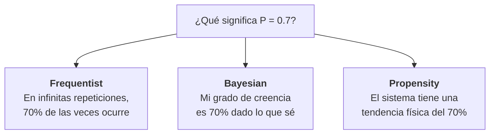

# D2: Incertidumbre y D3: Objetivo Matemático

## Dimensión 2: Interpretación de Probabilidad/Incertidumbre

*La probabilidad es un número. Pero ¿qué significa ese número?*

**Pregunta clave**: *"Cuando digo 'hay 70% de probabilidad de lluvia', ¿qué significa ese número?"*

:::example{title="La moneda"}
Dos estadísticos miran la misma moneda.

El **frecuentista** dice: "Existe una probabilidad verdadera de que caiga cara. No la conozco, pero si repito el experimento miles de veces, la frecuencia observada me la revelará."

El **bayesiano** dice: "La moneda ya tiene un lado arriba — solo no lo veo. Mi '50%' no describe la moneda, describe *lo que yo sé*. Si viera cómo la lanzas — el ángulo, la fuerza — mi probabilidad cambiaría. La incertidumbre está en mí, no en ella."

Ninguno está equivocado. El primero habla del mundo. El segundo habla del conocimiento sobre el mundo.
:::

| Interpretación | Filosofía | Qué es un parámetro **θ** | Qué es incertidumbre | Situación real |
|----------------|-----------|------------------------------|----------------------|----------------|
| **Frequentist** | Probabilidad = frecuencia límite en repeticiones infinitas | Constante fija desconocida | Variabilidad muestral | *A/B testing*: "si repitiera el experimento infinitas veces, ¿qué fracción favorece A?" |
| **Bayesian** | Probabilidad = grado de creencia subjetivo | Variable aleatoria con distribución | Se actualiza con evidencia | *Diagnóstico médico*: "dado el historial del paciente, mi creencia de que tiene X es 30%" |
| **Propensity** | Probabilidad = tendencia inherente del sistema | Propiedad del mecanismo causal | Irreducible, parte de la realidad | *Física cuántica*: la probabilidad es propiedad del electrón, no de nuestra ignorancia |

---

### Nota filosófica: Tipos de incertidumbre y el debate Popper-Jaynes

La distinción entre interpretaciones tiene raíces filosóficas profundas sobre la **naturaleza de la incertidumbre**:

**Karl Popper y la Propensity:**
Popper argumentó que la probabilidad puede ser una **tendencia objetiva** del mundo físico — una "propensión" real del sistema a producir ciertos resultados. Bajo esta vista, cuando decimos que un electrón tiene 50% de probabilidad de spin-up, esto es una propiedad física del electrón, no de nuestro conocimiento.

**E.T. Jaynes y la incertidumbre epistémica:**
En *"Probability Theory: The Logic of Science"*, Jaynes argumenta algo diferente. Considera el ejemplo de una **urna con bolas** o una **baraja de cartas**:

:::example{title="Jaynes y la baraja"}
Cuando asignamos P = 1/52 a sacar el As de Espadas de una baraja "bien barajada", ¿es porque la baraja tiene una "propensión" objetiva?

Jaynes diría: **No**. La baraja tiene un orden físico determinado después de barajar. Si conociéramos exactamente:
- La posición inicial de cada carta
- La mecánica exacta de cada movimiento del barajeo
- Las propiedades físicas de las cartas

...podríamos predecir el orden final con certeza. La probabilidad 1/52 refleja **nuestra ignorancia** (o nuestra decisión de no modelar la física), no una propiedad de la baraja.
:::

**Dos tipos de incertidumbre:**

| Tipo | Nombre | Descripción | ¿Reducible? | Ejemplo |
|------|--------|-------------|-------------|---------|
| **Epistémica** | "No sé" | Incertidumbre por falta de conocimiento | Sí, con más información | Baraja: no conozco el orden, pero existe uno |
| **Aleatoria** | "No se puede saber" | Incertidumbre irreducible del sistema | No, es fundamental | ¿Mecánica cuántica? (debatido) |

**La posición de Jaynes:**
Para Jaynes, casi toda la "aleatoriedad" que usamos en estadística y ML es realmente **epistémica disfrazada**. Modelamos urnas, dados, y barajas como "aleatorios" porque:
1. No conocemos los detalles mecánicos
2. No queremos (o no podemos) modelarlos
3. La aproximación probabilística funciona bien en la práctica

Esto no significa que la probabilidad sea inútil — al contrario, Jaynes la defiende como **la herramienta correcta para razonar bajo incertidumbre**. Pero es honesto sobre su naturaleza: describe nuestro estado de conocimiento, no necesariamente el mundo.

**Implicación práctica:**
En ML, la distinción aparece como:
- **Incertidumbre epistémica** → Incertidumbre sobre los parámetros del modelo (reducible con más datos)
- **Incertidumbre aleatoria (aleatoric)** → "Ruido" en los datos (supuestamente irreducible)

Pero siguiendo a Jaynes, incluso lo que llamamos "ruido aleatorio" puede ser epistémico — variables que no medimos o no incluimos en el modelo.

---

### Implicaciones prácticas

| Aspecto | Frequentist | Bayesian |
|---------|-------------|----------|
| Output del modelo | Punto óptimo **θ̂** | Distribución **P(θ\|Data)** |
| Intervalos de confianza | "Si repitiera, 95% contendrían el verdadero valor" | "Hay 95% de probabilidad de que **θ** esté aquí" |
| Priors | No existen (o son implícitos) | Explícitos y requeridos |
| Computación | Típicamente más simple | Típicamente más costosa (MCMC, VI) |

**Nota importante**: Puedes ser Deductivo+Frequentist, Deductivo+Bayesian, Inductivo+Frequentist, Inductivo+Bayesian. Son ejes independientes.

### ¿Cuándo usar cada interpretación?

| Situación | Enfoque recomendado |
|-----------|---------------------|
| Muchos datos, pocos parámetros | Frequentist (MLE basta) |
| Pocos datos, conocimiento previo fuerte | Bayesian (priors ayudan) |
| Necesitas cuantificar incertidumbre en parámetros | Bayesian |
| A/B testing, experimentos repetibles | Frequentist |
| Diagnóstico, actualización secuencial | Bayesian |
| Solo necesitas predicción puntual | Cualquiera (Frequentist más simple) |

> *Estas son heurísticas, no reglas. La elección óptima en esta dimensión depende de las otras cuatro — entender el sistema completo es más importante que optimizar cada eje por separado.*

---

## Dimensión 3: Objetivo Matemático

*No todos los que predicen quieren lo mismo.*

**Pregunta clave**: *"¿Qué cantidad estás tratando de estimar?"*

Una vez que decides cómo tratar la incertidumbre (D2), debes decidir **qué estimar**. Estas dos decisiones son naturalmente consecutivas: la interpretación probabilística define el marco, el objetivo define qué quieres dentro de ese marco.

**Recordatorio de notación:**

| Símbolo | Significado | Ejemplo |
|---------|-------------|---------|
| **X** | Features/inputs observados | Imagen, texto, mediciones |
| **Y** | Variable objetivo a predecir | Etiqueta, precio, categoría |
| **Z** | Variable auxiliar observada (información extra) | Metadata, contexto, otra modalidad |
| **L** | Variable latente (no observada, inferida) | Representación comprimida, estado oculto |
| **C** | Cluster o categoría discreta | Segmento de cliente, tópico |

La diferencia clave: **Z es observable** (la tienes en tus datos), **L es latente** (la infiere el modelo).

### Caso A: CON variable objetivo Y (Supervised)

| Objetivo | Notación | Qué obtienes | Cuándo usarlo | Situación real |
|----------|----------|--------------|---------------|----------------|
| **Distribución condicional** | **P(Y\|X)** | Forma completa de la distribución | Necesitas incertidumbre completa | *Pronóstico meteorológico*: no solo "lloverá" sino probabilidad por intensidad |
| **Valor esperado** | **E[Y\|X]** | Solo la media | Predicción puntual suficiente | *Precio de casa*: quieres UN número |
| **Efecto causal** | **P(Y\|do(X))** | Resultado de intervención | Decisiones, políticas | *Pricing*: ¿qué pasa si CAMBIO el precio del producto? |
| **Quantiles/Intervalos** | **Qα(Y\|X)** | Percentiles específicos | Riesgo, predicción robusta | *VaR en finanzas*: ¿cuál es la pérdida máxima al 95%? |

### Caso B: SIN variable objetivo (Unsupervised)

| Objetivo | Notación | Qué obtienes | Cuándo usarlo | Situación real |
|----------|----------|--------------|---------------|----------------|
| **Distribución de datos** | **P(X)** | Densidad de probabilidad | Detección de anomalías, generación | *Fraude*: transacciones con baja **P(X)** son sospechosas |
| **Representación** | **ϕ(X) → L** | Embedding/compresión (L es latente) | Reducción de dimensión, transfer | *Autoencoder*: comprimir imágenes; *BERT*: embeddings de texto |
| **Estructura latente discreta** | **P(C\|X)** | Asignación a clusters | Segmentación, taxonomía | *Segmentar clientes* en grupos de comportamiento |
| **Reconstrucción** | **E[X]** o **X̂** | Versión "limpia" de input | Denoising, imputación | *Restaurar imagen borrosa*, completar datos faltantes |

### Caso C: MIXTO (Self-supervised, Generativo)

| Objetivo | Notación | Qué obtienes | Cuándo usarlo | Situación real |
|----------|----------|--------------|---------------|----------------|
| **Distribución con latentes** | **P(X,L)** | Modelo generativo con espacio latente | Datos faltantes, generación | *VAE*: generar caras nuevas; L captura variaciones |
| **Predicción de parte de X** | **P(X₂\|X₁)** | Y derivado del mismo X | Pretraining, representaciones | *GPT*: predecir siguiente palabra; *BERT*: predecir palabra enmascarada |

### ¿Qué objetivo elegir?

| Tu necesidad | Objetivo recomendado |
|--------------|----------------------|
| Un número (predicción puntual) | **E[Y\|X]** |
| Probabilidad de cada clase | **P(Y\|X)** |
| Cuantificar riesgo (colas) | **Qα(Y\|X)** (quantiles) |
| Tomar decisiones / intervenir | **P(Y\|do(X))** (causal) |
| Detectar anomalías | **P(X)** (densidad) |
| Comprimir / representar datos | **ϕ(X)** (embeddings) |
| Agrupar sin etiquetas | **P(C\|X)** (clustering) |
| Pretraining para transfer | **P(X₂\|X₁)** (self-supervised) |

> *Estas son heurísticas, no reglas. La elección óptima en esta dimensión depende de las otras cuatro — entender el sistema completo es más importante que optimizar cada eje por separado.*

---

**Anterior:** [Fuente del conocimiento (D1)](02_fuente_del_conocimiento.md) | **Siguiente:** [Arquitectura y supuestos (D4 + D5) →](04_arquitectura_y_supuestos.md)
