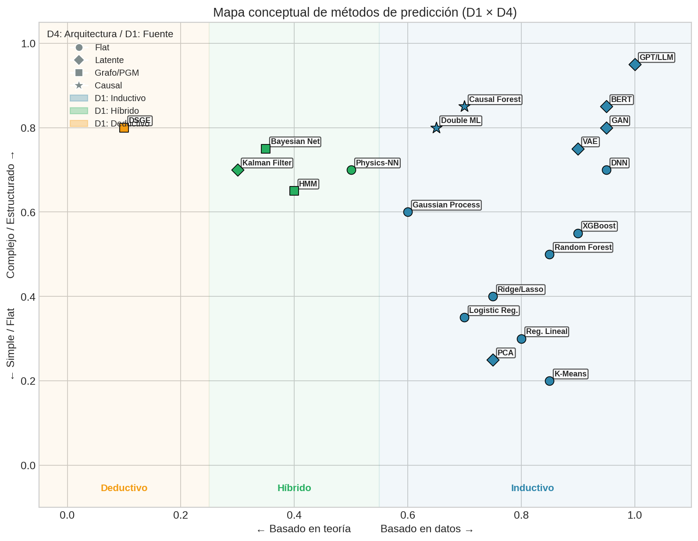
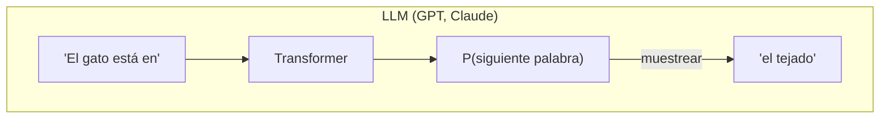
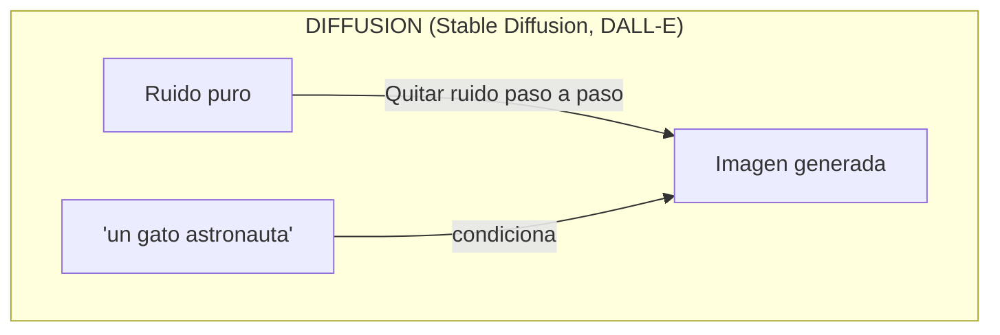

# Atlas de Métodos de Predicción

Con las cinco dimensiones en mano, podemos ubicar cualquier método concreto como un punto en este espacio. Lo que sigue es un atlas de los métodos más comunes — no exhaustivo, pero sí representativo. Cada método concreto es un punto en el espacio 5D. Las tablas siguientes ubican los métodos más comunes — no como una lista para memorizar, sino como un mapa para orientarse.

## Métodos Supervisados (con Y)

En aprendizaje supervisado tenemos pares **(X, Y)** y queremos aprender la relación entre ellos. La mayoría de estos métodos son **inductivos** (aprenden de datos) y **frecuentistas** (optimizan una función de pérdida). Las diferencias principales están en:

- **Objetivo**: ¿Queremos el valor esperado **E[Y|X]** o la distribución completa **P(Y|X)**?
- **Supuesto**: ¿Qué estructura asumimos? (regularización, arquitectura, priors)
- **Arquitectura**: ¿Asumimos estructura plana, grafos, o relaciones causales?

| Método | D1: Fuente | D2: Prob | D3: Objetivo | D4: Arquitectura | D5: Supuesto | Caso de uso típico |
|--------|------------|----------|--------------|------------------|-----------------|-------------------|
| **Regresión Lineal** | Inductivo | Freq | **E[Y\|X]** | Flat | Ninguna/L2 | Predicción de ventas simple |
| **Ridge/Lasso** | Inductivo | Freq | **E[Y\|X]** | Flat | L2/L1 | Muchas features, pocas observaciones |
| **Logistic Regression** | Inductivo | Freq | **P(Y\|X)** | Flat | Ninguna/L2 | Clasificación binaria interpretable |
| **Random Forest** | Inductivo | Freq | **E[Y\|X]** | Flat | Ensemble | Clasificación tabular robusta |
| **XGBoost/LightGBM** | Inductivo | Freq | **E[Y\|X]** | Flat | Boosting+Regularización | Competencias, datos tabulares |
| **Deep Neural Net** | Inductivo | Freq | **E[Y\|X]** | Flat | Arquitectura+L2 | Imágenes, texto, señales |
| **Gaussian Process** | Inductivo | Bayes | **P(Y\|X)** | Flat | Kernel (prior) | Optimización con pocos datos |
| **Bayesian Neural Net** | Inductivo | Bayes | **P(Y\|X)** | Flat | Prior en pesos | Incertidumbre en deep learning |
| **Quantile Regression** | Inductivo | Freq | **Qα(Y\|X)** | Flat | Ninguna | VaR en finanzas, predicción robusta |
| **Bayesian Network** | Híbrido | Bayes | **P(Y,X,Z)** | Grafo | Estructura explícita | Diagnóstico, sistemas expertos |
| **DSGE calibrado** | Deductivo | Freq | **P(Y\|X)** | Grafo | Momentos | Política macroeconómica |
| **Bayesian DSGE** | Deductivo | Bayes | **P(Y\|X)** | Grafo | Prior+Momentos | Bancos centrales |
| **Causal Forest** | Inductivo | Freq | **P(Y\|do(X))** | Causal | Ensemble | Efectos heterogéneos de tratamiento |
| **Double ML** | Inductivo | Freq | **P(Y\|do(X))** | Causal | Cross-fitting | Inferencia causal con ML |
| **Physics-Informed NN** | Híbrido | Freq | **E[Y\|X]** | Flat | Ecuaciones | Simulación con datos escasos |
| **Conformal Prediction** | Inductivo | Freq | Intervalo | Flat | Calibración | Intervalos con garantías |

## Métodos No Supervisados (sin Y)

Sin variable objetivo **Y**, el problema cambia: ¿qué podemos aprender solo de **X**? Las respuestas principales son:

- **P(X)**: Modelar la distribución de los datos (densidad, generación, detección de anomalías)
- **ϕ(X)**: Encontrar representaciones comprimidas (embeddings, reducción de dimensión)
- **Clusters**: Agrupar observaciones similares

Casi todos usan arquitectura **latente** — asumen que hay estructura oculta que explica los datos observados.

| Método | D1: Fuente | D2: Prob | D3: Objetivo | D4: Arquitectura | D5: Supuesto | Caso de uso típico |
|--------|------------|----------|--------------|------------------|-----------------|-------------------|
| **K-Means** | Inductivo | Freq | Clusters | Flat | K fijo | Segmentación de clientes |
| **Gaussian Mixture Model** | Inductivo | Freq/Bayes | **P(X)** | Latente | Mezcla Gaussiana | Clustering probabilístico |
| **PCA** | Inductivo | Freq | **ϕ(X)** | Latente | Linealidad | Reducción de dimensión |
| **t-SNE/UMAP** | Inductivo | Freq | **ϕ(X)** | Latente | Preservar vecindarios | Visualización |
| **Autoencoder** | Inductivo | Freq | **E[X]** (reconstrucción) | Latente | Arquitectura | Compresión, denoising |
| **VAE** | Inductivo | Bayes | **P(X)** | Latente | Prior Gaussiano | Generación de imágenes |
| **GAN** | Inductivo | Freq | **P(X)** implícito | Latente | Adversarial | Generación realista |
| **Normalizing Flow** | Inductivo | Freq | **P(X)** exacto | Latente | Invertibilidad | Densidad exacta, generación |
| **KDE** | Inductivo | Freq | **P(X)** | Flat | Kernel | Detección de anomalías simple |
| **Isolation Forest** | Inductivo | Freq | Anomalía score | Flat | Ensemble | Detección de outliers |

## Métodos Self-Supervised

El aprendizaje auto-supervisado es un truco ingenioso: **crear Y a partir de X**. En lugar de etiquetar datos manualmente, diseñamos tareas donde la supervisión viene de los datos mismos:

- **Predecir la siguiente palabra** (GPT): Y = siguiente token, X = tokens anteriores
- **Predecir palabras ocultas** (BERT): Y = palabra enmascarada, X = contexto
- **Comparar versiones aumentadas** (SimCLR): Y = "misma imagen", X = dos augmentaciones

El objetivo real no es resolver estas tareas — es aprender **representaciones ϕ(X)** útiles para tareas downstream.

| Método | D1: Fuente | D2: Prob | D3: Objetivo | D4: Arquitectura | D5: Supuesto | Caso de uso típico |
|--------|------------|----------|--------------|------------------|-----------------|-------------------|
| **Word2Vec** | Inductivo | Freq | **P(ctx\|word)** | Latente | Ventana de contexto | Embeddings de palabras |
| **BERT** | Inductivo | Freq | **P(Xₘₐₛₖ\|Xᵣₑₛₜₒ)** | Latente | Transformer | Embeddings de texto |
| **GPT** | Inductivo | Freq | **P(Xₜ₊₁\|X₁:ₜ)** | Latente | Transformer | Generación de texto |
| **SimCLR** | Inductivo | Freq | **ϕ(X)** contrastivo | Latente | Augmentaciones | Representaciones visuales |
| **CLIP** | Inductivo | Freq | **ϕ(X) ≈ ϕ(Z)** | Latente | Contrastivo multimodal | Imagen-texto alignment |
| **MAE** | Inductivo | Freq | **E[Xₘₐₛₖ\|Xᵥᵢₛ]** | Latente | Masking+Transformer | Pretraining visual |

## Métodos Secuenciales/Temporales (Markov)

Cuando los datos tienen estructura temporal, la **propiedad de Markov** es una restricción poderosa: el futuro solo depende del presente, no de toda la historia.

**P(Xₜ₊₁ | X₁, X₂, ..., Xₜ) = P(Xₜ₊₁ | Xₜ)**

Esta simplificación hace tratable modelar secuencias largas. Los métodos varían en:

- **Observable vs Latente**: ¿El estado es visible (Markov Chain) o hay que inferirlo (HMM, Kalman)?
- **Lineal vs No lineal**: ¿Las transiciones son lineales (Kalman) o arbitrarias (Particle Filter)?
- **Discreto vs Continuo**: ¿Estados discretos (HMM) o continuos (Kalman)?

Son **híbridos** en D1 porque combinan estructura teórica (la propiedad de Markov) con estimación de parámetros desde datos.

| Método | D1: Fuente | D2: Prob | D3: Objetivo | D4: Arquitectura | D5: Supuesto | Caso de uso típico |
|--------|------------|----------|--------------|------------------|-----------------|-------------------|
| **Cadena de Markov** | Híbrido | Freq | **P(X_{t+1}\|X_t)** | Grafo | Propiedad Markov | Transiciones de estados, PageRank |
| **HMM** | Híbrido | Freq/Bayes | **P(Y\|L), P(L_{t+1}\|L_t)** | Latente+Grafo | Markov + Emisión | Reconocimiento de voz, genómica |
| **Kalman Filter** | Híbrido | Bayes | **P(L_t\|Y_{1:t})** | Latente+Grafo | Gaussiano+Lineal | Tracking, navegación, fusión sensores |
| **Particle Filter** | Híbrido | Bayes | **P(L_t\|Y_{1:t})** | Latente+Grafo | Markov (no lineal) | Tracking con no-linealidades |

## IA Generativa Moderna: LLMs y Generadores de Imágenes

Los modelos de "IA Generativa" que dominan hoy (ChatGPT, Stable Diffusion, DALL-E, Midjourney) son combinaciones específicas en nuestra taxonomía de 5 dimensiones:

| Modelo | Tipo | D1 | D2 | D3: Objetivo | D4: Arquitectura | D5: Supuesto |
|--------|------|----|----|--------------|------------------|-----------------|
| **GPT / LLaMA** | LLM | Inductivo | Freq | **P(Xₜ₊₁\|X₁:ₜ)** | Latente | Transformer + Scale |
| **Claude / Gemini** | LLM | Inductivo | Freq | **P(Xₜ₊₁\|X₁:ₜ)** | Latente | Transformer + RLHF |
| **BERT** | Encoder | Inductivo | Freq | **P(Xₘₐₛₖ\|Xᵣₑₛₜₒ)** | Latente | Transformer (bidireccional) |
| **Stable Diffusion** | Imagen | Inductivo | Freq | **P(X\|texto)** | Latente | U-Net + Diffusion |
| **DALL-E 3** | Imagen | Inductivo | Freq | **P(X\|texto)** | Latente | Transformer + Diffusion |
| **Midjourney** | Imagen | Inductivo | Freq | **P(X\|texto)** | Latente | Diffusion |
| **Sora** | Video | Inductivo | Freq | **P(X\|texto)** | Latente | Diffusion Transformer |

**Insight clave**: Todos comparten:
- **D1: Inductivo** — aprenden de datos masivos, no de teoría
- **D4: Latente** — trabajan con representaciones internas comprimidas
- La diferencia está en **D3** (qué predicen) y **D5** (qué supuesto/arquitectura usan)

### ¿Cómo funcionan?

> Autoregresivo: genera token por token, cada uno condiciona el siguiente.
> Objetivo: P(Xₜ₊₁ | X₁, X₂, ..., Xₜ)

> Entrenamiento: imagen real → agregar ruido gradualmente → aprender a QUITAR ruido.
> Generación: ruido puro → quitar ruido condicionado en texto → imagen.
> Objetivo: P(X | texto) via proceso de denoising.

**¿Por qué son "generativos"?**

| Modelo | ¿Modela P(X)? | ¿Genera contenido nuevo? | Tipo de "generativo" |
|--------|---------------|--------------------------|----------------------|
| LLM | Sí, P(texto) autoregresivamente | Sí | Generativo (capacidad + arquitectura) |
| Diffusion | Sí, P(imagen\|texto) | Sí | Generativo (capacidad + arquitectura) |
| BERT | No directamente | No (es encoder) | No generativo |
| Clasificador | No, solo P(Y\|X) | No | Discriminativo |

---

## Combinaciones Comunes vs Raras

### Combinaciones muy comunes (campo maduro)
- **Inductivo + Frequentist + E[Y|X] + Flat + Arquitectura** = Deep Learning estándar
- **Inductivo + Bayesian + P(Y|X) + Flat + Prior** = Gaussian Processes
- **Deductivo + Frequentist + Grafo + Momentos** = Economía estructural

### Combinaciones menos comunes pero válidas (campo emergente)
- **Deductivo + Bayesian + Grafo + Prior** = Bayesian DSGE (bancos centrales)
- **Inductivo + Frequentist + Causal + Invarianza** = IRM, Causal ML
- **Híbrido + Frequentist + P(X) + Arquitectura+Ecuaciones** = Physics-informed generative models

### Combinaciones raras/inexploradas (oportunidades de investigación)
- **Deductivo + Frequentist + ϕ(X) + Latente** = ¿Autoencoders con estructura teórica?
- **Deductivo + cualquier cosa + Deep Learning** = Espacio muy subexplorado
- La mayoría de Deep Learning es Inductivo; hay oportunidad en Deductivo+Deep

---

**Anterior:** [Arquitectura y supuestos (D4 + D5)](04_arquitectura_y_supuestos.md) | **Siguiente:** [Mapa y heurísticas →](06_mapa_y_heuristicas.md)
