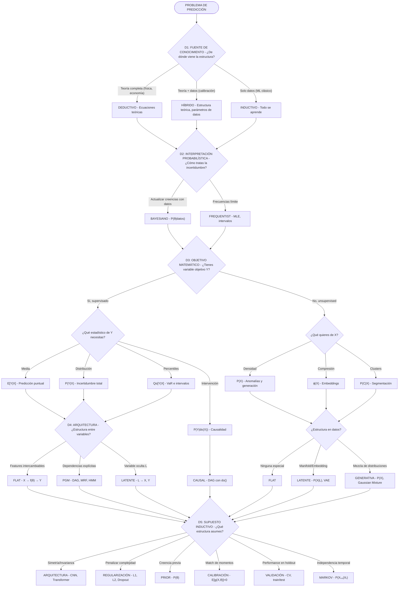
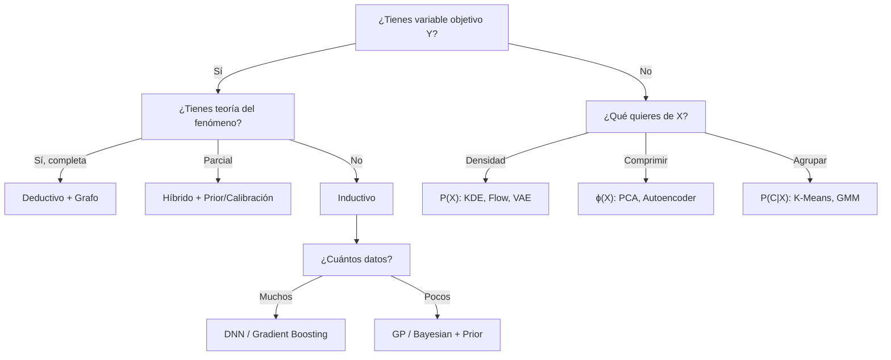

# Mapa Visual, Heurísticas y Casos de Estudio

Saber que existen cinco dimensiones es útil. El siguiente diagrama muestra cómo se relacionan las dimensiones entre sí — no es una guía de qué elegir, sino un mapa de las opciones disponibles.

## Mapa Visual de la Taxonomía

### Flujo de las 5 dimensiones



### Combinaciones comunes

| Si tu situación es... | Considera... |
|-----------------------|--------------|
| Muchos datos, sin teoría previa | Inductivo + Frequentist + DNN |
| Pocos datos, conocimiento experto | Híbrido + Bayesian + PGM |
| Necesitas tomar decisiones/políticas | Cualquier D1 + Causal + Invarianza |
| Imágenes/texto/señales | Inductivo + Arquitectura especializada (CNN, Transformer) |
| Datos tabulares estructurados | Inductivo + Gradient Boosting |
| Cuantificar riesgo | Quantiles o Bayesian + **P(Y\|X)** |
| Detectar anomalías | Inductivo + **P(X)** + Density estimation |
| Generar datos sintéticos | Inductivo + **P(X)** + VAE/GAN/Flow |
| Transfer learning | Self-supervised + Latente |
| Simulación con física conocida | Híbrido + Physics-Informed |
| Economía/macro | Deductivo + Calibración/Momentos |

---

## Heurísticas para Elegir

> **Advertencia**: Lo que sigue son heurísticas, no reglas. Son puntos de partida para orientar la exploración, no respuestas definitivas. El contexto siempre manda.

### Heurísticas por dimensión

Cada dimensión tiene preguntas que ayudan a elegir:

**D1: Fuente de Conocimiento**
- Pregunta: *¿Tienes teoría validada del fenómeno?*
- Sí → Deductivo o Híbrido
- No → Inductivo
- ¿Pocos datos? → Híbrido puede ayudar

**D2: Interpretación de Probabilidad**
- Pregunta: *¿Necesitas incertidumbre sobre los parámetros?*
- Sí → Bayesiano
- Solo predicción puntual → Frequentist suele bastar

**D3: Objetivo Matemático**
- Pregunta: *¿Qué harás con la predicción?*
- Decisión binaria → **P(Y|X)**
- Un número → **E[Y|X]**
- Cuantificar riesgo → Quantiles
- Intervenir/causar → **do(X)**

**D4: Arquitectura de Variables**
- Pregunta: *¿Hay estructura conocida entre variables?*
- Sí, dependencias explícitas → PGM/Grafo
- Datos de alta dimensión → Latente
- Sin estructura especial → Flat

**D5: Supuesto Inductivo**
- Pregunta: *¿Qué invariancias o estructura conoces del problema?*
- Invarianza espacial → CNN
- Invarianza secuencial → Transformer/Markov
- No sé → Regularización + Cross-validation

### Reglas generales (aproximadas)

Algunas combinaciones que suelen funcionar:

- **Pocos datos + mucha teoría** → Deductivo o Híbrido + Bayesiano + PGM
- **Muchos datos + poca teoría** → Inductivo + Frequentist + DNN o Gradient Boosting
- **Necesitas explicar el modelo** → PGM, modelos lineales, evitar cajas negras
- **Necesitas efectos causales** → Arquitectura Causal (no hay atajo)
- **Alta dimensión (imágenes, texto, audio)** → Arquitectura especializada es casi obligatoria (CNN, Transformer)
- **Series de tiempo** → Propiedad de Markov + arquitectura temporal (LSTM, Transformer)

### Lo que las heurísticas NO te dicen

- **Qué features usar** — eso es conocimiento de dominio
- **Cuántos datos son "suficientes"** — depende de la complejidad del problema
- **Si el modelo funcionará** — solo los datos de prueba te dirán
- **Cuál es el mejor hiperparámetro** — eso es validación cruzada

> **Nota final**: Estas heurísticas son mapas aproximados. El territorio real es tu problema específico — con sus datos, sus requisitos, sus restricciones. No existe receta universal. El objetivo es reducir el espacio de búsqueda, no eliminarlo.

### Árbol de decisión rápido



---

## Casos de Estudio

### Caso 1: Economía Macroeconómica (DSGE)

**Problema**: Simular efectos de política monetaria

| Dimensión | Elección | Justificación |
|-----------|----------|---------------|
| D1: Fuente | **Deductivo** | Teoría económica (Euler equations, equilibrio general) dicta la estructura |
| D2: Probabilidad | **Frequentist** (o Bayesian en bancos centrales modernos) | Calibrar a momentos observados |
| D3: Objetivo | **P(Y\|X)** | Distribución de outcomes dado shocks |
| D4: Arquitectura | **Grafo** | Sistema de ecuaciones con dependencias explícitas |
| D5: Supuesto | **Momentos/Calibración** | Ajustar para reproducir volatilidades, correlaciones observadas |

:::example{title="Flujo DSGE"}
```
Teoría microeconómica → Ecuaciones estructurales → Parámetros a calibrar
                                                           │
                                            Datos macroeconómicos
                                                           │
                                           Match de momentos (SMM)
                                                           │
                                           Modelo calibrado → Simulación de política
```
:::

---

### Caso 2: Computer Vision (Clasificación de imágenes)

**Problema**: Clasificar imágenes en categorías

| Dimensión | Elección | Justificación |
|-----------|----------|---------------|
| D1: Fuente | **Inductivo** | No hay "teoría de imágenes"; patrones emergen de datos |
| D2: Probabilidad | **Frequentist** | Optimizar cross-entropy loss |
| D3: Objetivo | **P(Y\|X)** via softmax | Distribución sobre clases |
| D4: Arquitectura | **Flat** (pero CNN impone estructura) | Todas las features → output |
| D5: Supuesto | **Arquitectura (CNN)** | Invarianza traslacional: objeto es igual donde sea en la imagen |

:::example{title="¿Por qué CNN?"}
Un gato en la esquina superior izquierda es el mismo gato que en el centro. Convolución + pooling implementan esta invarianza matemáticamente. Es un "prior duro" sobre la clase de funciones.
:::

---

### Caso 3: Medicina (Decisión de tratamiento)

**Problema**: ¿Dar tratamiento A o B a un paciente?

| Dimensión | Elección | Justificación |
|-----------|----------|---------------|
| D1: Fuente | **Híbrido** | Conocimiento médico + datos de ensayos |
| D2: Probabilidad | **Bayesian** | Necesitas incertidumbre para decisiones de vida/muerte |
| D3: Objetivo | **P(Y\|do(X))** | ¿Qué pasa si DOY este tratamiento? (causal) |
| D4: Arquitectura | **Causal** | Distinguir correlación de causación |
| D5: Supuesto | **Prior clínico** | Conocimiento médico previo sobre efectos |

:::example{title="¿Por qué causal?"}
Pacientes que reciben tratamiento A pueden ser diferentes de los que reciben B (confounding). Queremos saber qué pasa si INTERVENIMOS, no solo qué se observa. Un modelo correlacional podría decir "A es mejor" porque pacientes más sanos lo reciben.
:::

---

### Caso 4: Finanzas (Value at Risk)

**Problema**: ¿Cuál es la pérdida máxima del portafolio al 95%?

| Dimensión | Elección | Justificación |
|-----------|----------|---------------|
| D1: Fuente | **Inductivo** | Mercados son complejos, sin teoría simple |
| D2: Probabilidad | **Frequentist** | Estimar quantiles empíricos |
| D3: Objetivo | **Q₀.₀₅(Y\|X)** | El percentil 5, no la media |
| D4: Arquitectura | **Flat** | Features de mercado → pérdida |
| D5: Supuesto | **Validación** | Backtesting en datos históricos |

:::example{title="¿Por qué quantiles, no media?"}
La media de pérdidas es irrelevante para riesgo. Importa el peor caso razonable (cola de la distribución). **E[Y|X]** puede ser positivo mientras **Q₀.₀₅(Y|X)** es muy negativo.
:::

---

### Caso 5: NLP Moderno (GPT, BERT)

**Problema**: Representaciones de texto para múltiples tareas

| Dimensión | Elección | Justificación |
|-----------|----------|---------------|
| D1: Fuente | **Inductivo** | No hay gramática formal suficiente; aprender de corpus |
| D2: Probabilidad | **Frequentist** | Maximizar likelihood |
| D3: Objetivo | **P(Xₜ₊₁\|X₁:ₜ)** (GPT) o **P(Xₘₐₛₖ\|Xᵣₑₛₜₒ)** (BERT) | Self-supervised: Y se deriva de X |
| D4: Arquitectura | **Latente** | Aprender representación oculta del lenguaje |
| D5: Supuesto | **Arquitectura Transformer** | Atención permite capturar dependencias largas |

:::example{title="¿Por qué self-supervised?"}
Etiquetar texto para cada tarea es costosísimo. El propio texto contiene "supervisión gratuita" (predecir palabras). Representaciones aprendidas transfieren a muchas tareas downstream.
:::

---

### Caso 6: Detección de Fraude

**Problema**: Identificar transacciones fraudulentas

| Dimensión | Elección | Justificación |
|-----------|----------|---------------|
| D1: Fuente | **Inductivo** | Fraude evoluciona, no hay modelo teórico estable |
| D2: Probabilidad | **Frequentist** | Estimar densidad |
| D3: Objetivo | **P(X)** | Transacciones anómalas = baja probabilidad |
| D4: Arquitectura | **Flat** | Features de transacción |
| D5: Supuesto | **Densidad/Ensemble** | KDE, Isolation Forest |

:::example{title="¿Por qué unsupervised?"}
Hay muy pocos ejemplos de fraude etiquetado. Los fraudulentos son "diferentes" de los normales. **P(X)** bajo = "esta transacción no se parece a las normales".
:::

---

### Caso 7: Robótica (Fusión de sensores)

**Problema**: Estimar posición real a partir de GPS + acelerómetro + giroscopio

| Dimensión | Elección | Justificación |
|-----------|----------|---------------|
| D1: Fuente | **Híbrido** | Modelo físico de movimiento + calibración con datos |
| D2: Probabilidad | **Bayesian** | Actualizar creencia sobre posición con cada medición |
| D3: Objetivo | **P(L\|X,Z)** | Distribución de posición latente dado sensores |
| D4: Arquitectura | **Latente** | Posición real L genera observaciones ruidosas X, Z |
| D5: Supuesto | **Modelo de proceso (Kalman)** | Física del movimiento como prior |

:::example{title="¿Por qué latente + Bayesian?"}
La posición real es UNA, pero la medimos con múltiples sensores ruidosos. Cada sensor tiene diferente tipo de ruido (GPS salta, acelerómetro drifta). Kalman filter fusiona óptimamente bajo supuestos Gaussianos.
:::

---

### Caso 8: Física Computacional (Simulación de fluidos)

**Problema**: Resolver Navier-Stokes rápidamente

| Dimensión | Elección | Justificación |
|-----------|----------|---------------|
| D1: Fuente | **Híbrido** | Ecuaciones de física conocidas + datos para acelerar |
| D2: Probabilidad | **Frequentist** | Minimizar error de reconstrucción |
| D3: Objetivo | **E[Y\|X]** | Estado futuro del fluido dado inicial |
| D4: Arquitectura | **Flat** (con estructura de física en loss) | Features → estado |
| D5: Supuesto | **Ecuaciones diferenciales** | Loss incluye residual de Navier-Stokes |

:::example{title="¿Por qué Physics-Informed?"}
Resolver ecuaciones exactas es muy lento. NN puede aproximar solución rápidamente. Pero sin física, NN puede violar conservación de masa/energía. Agregar ecuaciones al loss = "prior de física".
:::

---

## Reflexión Final

> *"All models are wrong, but some are useful."*
> — George Box

Hemos recorrido un territorio vasto. Desde los axiomas de la física hasta las redes neuronales de mil millones de parámetros. Desde el teorema de Bayes hasta los filtros de Kalman. Desde la humilde media aritmética hasta los efectos causales que distinguen correlación de intervención.

Pero si tuvieras que quedarte con una sola idea, que sea esta: **no existe el método de predicción**. No hay algoritmo universalmente superior, ni paradigma que los gobierne a todos. Lo que existe es un espacio de decisiones — cinco dimensiones donde cada elección tiene consecuencias, donde cada supuesto abre puertas y cierra otras.

La predicción, al final, es un acto de humildad disfrazado de confianza. Decimos "el modelo predice X" cuando en realidad queremos decir "dados estos supuestos, estos datos, y estas restricciones, nuestra mejor estimación es X". La honestidad está en conocer los supuestos. La sabiduría está en elegirlos bien.

---

Ante cualquier método de predicción, pregunta:

- *¿De dónde viene su conocimiento?* ¿De teoría, de datos, o de ambos?
- *¿Cómo trata la incertidumbre?* ¿Como frecuencia o como creencia?
- *¿Qué intenta estimar?* ¿Una media, una distribución, un efecto causal?
- *¿Qué estructura asume?* ¿Variables planas, grafos, latentes?
- *¿Cómo restringe las hipótesis?* ¿Con arquitectura, regularización, priors?

Apunta a **entender qué estamos haciendo cuando intentamos predecirlo**.

---

> *"The oracle sees, but cannot choose."*
> — Dune Messiah

> *«La información no es suficiente para garantizar la vida.»*
> — Ghost in the Shell (1995)

Este documento ha tratado sobre **ver** — sobre estimar, predecir, cuantificar incertidumbre. Pero ver no es actuar. El oráculo ve el futuro, pero eso no le dice qué hacer con esa visión.

Existe en el campo una especie de **fetiche con la predicción** — en el sentido casi marxista del término: una fascinación con el objeto (el modelo, la métrica, el accuracy) que oscurece las relaciones subyacentes. Nos obsesionamos con P(Y|X) y olvidamos preguntar: ¿para qué queremos saber Y? ¿Qué haremos con esa predicción?

Porque la inteligencia artificial no es, en su esencia, sobre predicción. Es sobre **agentes**, sobre **decisiones**, sobre sistemas que actúan en el mundo y aprenden de las consecuencias. Es sobre inteligencia — la capacidad de adaptarse, de elegir, de perseguir objetivos en entornos inciertos. La predicción es una herramienta, no el fin.

Los LLMs han ayudado a recordarnos esto. Después de años de obsesión con benchmarks de clasificación y métricas de regresión, los modelos de lenguaje trajeron de vuelta la conversación sobre **agentes**: sistemas que razonan, que planean, que interactúan. Que no solo predicen la siguiente palabra, sino que la usan para lograr algo.

---

**Anterior:** [Atlas de métodos](05_atlas_de_metodos.md) | **Inicio:** [Índice del módulo](00_index.md)
