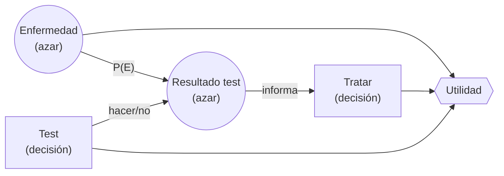

# Decidir Bajo Incertidumbre

> *"In any moment of decision, the best thing you can do is the right thing. The worst thing you can do is nothing."*
> — Theodore Roosevelt

---

## El principio de Máxima Utilidad Esperada (MEU)

Si aceptamos los axiomas vNM (sección anterior), la forma racional de decidir bajo riesgo es:

$$a^{∗} = \arg\max_{a \in A} \sum_{s \in S} P(s) \cdot U(o(a, s))$$

o más compactamente:

$$a^{∗} = \arg\max_{a \in A} \; E_S[U(a, S)]$$

Cuando el agente observa evidencia $x$ antes de decidir (lo que viene de predicción), las creencias se actualizan y la fórmula se condiciona:

$$a^{∗}(x) = \arg\max_{a \in A} \sum_{s \in S} P(s \mid x) \cdot U(o(a, s))$$

La versión sin condicionar usa la prior $P(s)$; la versión condicionada usa la posterior $P(s \mid x)$, que es exactamente lo que el módulo 08 nos enseñó a estimar. El principio es el mismo — solo cambian las creencias.

**Observación clave:** Esto es optimización (módulo 07), pero con un ingrediente nuevo — la probabilidad. En lugar de maximizar $f(x)$ directamente, maximizamos el *promedio ponderado* de $U$ sobre los posibles estados.

| Componente | Viene de... |
|-----------|------------|
| $\arg\max$ | Optimización (módulo 07) |
| $P(s)$ o $P(s \mid x)$ | Probabilidad (módulo 05) + Predicción (módulo 08) |
| $U(o(a,s))$ | Preferencias (sección 9.2) |

:::example{title="Paraguas con MEU"}
Con $P(\text{Lluvia}) = 0.4$, $P(\text{Sol}) = 0.6$:

$E[U(\text{Llevar})] = 0.4 \times 8 + 0.6 \times 5 = 3.2 + 3.0 = 6.2$

$E[U(\text{No llevar})] = 0.4 \times 1 + 0.6 \times 10 = 0.4 + 6.0 = 6.4$

$a^{∗} = \text{No llevar}$ (6.4 > 6.2)

Pero si $P(\text{Lluvia}) = 0.7$:

$E[U(\text{Llevar})] = 0.7 \times 8 + 0.3 \times 5 = 5.6 + 1.5 = 7.1$

$E[U(\text{No llevar})] = 0.7 \times 1 + 0.3 \times 10 = 0.7 + 3.0 = 3.7$

$a^{∗} = \text{Llevar}$ (7.1 > 3.7)

El **punto de cruce** es el valor de $p$ donde ambas acciones son equivalentes. ¿Puedes calcularlo?
:::

---

## Árboles de decisión

Cuando las decisiones son **secuenciales** (una decisión depende de información revelada después de la primera), usamos **árboles de decisión**.

### Elementos del árbol

| Nodo | Forma | Significado |
|------|-------|-------------|
| **Decisión** | Cuadrado | El agente elige |
| **Azar** | Círculo | La naturaleza "elige" (probabilidades) |
| **Terminal** | Valor | Utilidad del resultado final |

### Inducción hacia atrás (backward induction)

Para resolver un árbol de decisión:

1. **Empieza por las hojas** (resultados terminales).
2. **En cada nodo de azar:** calcula la utilidad esperada (promedio ponderado de hijos).
3. **En cada nodo de decisión:** elige la rama con mayor utilidad esperada.
4. **Propaga hacia la raíz.**

:::example{title="Perforación petrolera"}
1. **Decisión 1:** ¿Perforar o no?
   - No perforar → &#36;0k
   - Perforar → costo de &#36;100k + incertidumbre

2. **Azar 1:** ¿Hay petróleo? ($p = 0.3$)
   - Seco ($p = 0.7$) → -&#36;100k
   - Petróleo ($p = 0.3$) → Decisión 2

3. **Decisión 2:** ¿Pozo grande o chico?
   - Pozo chico → &#36;300k
   - Pozo grande → Azar 2

4. **Azar 2:** ¿Alto o bajo rendimiento? ($p = 0.5$ cada uno)
   - Alto → &#36;800k
   - Bajo → &#36;200k

**Resolución (hacia atrás):**
- Azar 2: $EU = 0.5 \times 800 + 0.5 \times 200 = 500$
- Decisión 2: $\max(500, 300) = 500$ → Pozo grande
- Azar 1: $EU = 0.3 \times 500 + 0.7 \times (-100) = 150 - 70 = 80$
- Decisión 1: $\max(80, 0) = 80$ → Perforar

**Respuesta:** Perforar, y si hay petróleo, hacer pozo grande. $EU = 80k$.
:::

---

## Redes de decisión

Las redes de decisión (influence diagrams) son una extensión de las redes Bayesianas que incorporan decisiones y utilidades:

| Tipo de nodo | Forma | Significado |
|-------------|-------|-------------|
| **Azar** (chance) | Óvalo | Variable aleatoria (como en Bayes nets) |
| **Decisión** | Rectángulo | Variable que el agente controla |
| **Utilidad** | Diamante | Función de utilidad (depende de otros nodos) |

Las flechas representan:
- **Hacia nodos de azar:** dependencias probabilísticas
- **Hacia nodos de decisión:** información disponible al decidir
- **Hacia nodos de utilidad:** variables que afectan la utilidad

:::example{title="Red de decisión: test médico"}

- **Óvalos** (Enfermedad, Resultado): variables aleatorias
- **Rectángulos** (Test, Tratar): decisiones del agente
- **Diamante** (Utilidad): función que depende de la enfermedad real, el tratamiento elegido y el costo del test
- La flecha de Resultado → Tratar significa que observamos el resultado del test *antes* de decidir si tratar
:::

La ventaja sobre árboles: representación compacta cuando hay muchas variables. Un árbol con 5 variables binarias tiene $2^5 = 32$ hojas; una red tiene 5 nodos.

---

## Valor de la Información

Una de las preguntas más poderosas en teoría de la decisión: **¿cuánto vale obtener más información antes de decidir?**

### La idea en un ejemplo

Imagina el problema del paraguas con $P(\text{Lluvia}) = 0.4$:

**Sin información** (decides a ciegas):
- $EU(\text{Llevar}) = 0.4 \times 8 + 0.6 \times 5 = 6.2$
- $EU(\text{No llevar}) = 0.4 \times 1 + 0.6 \times 10 = 6.4$ ← mejor
- Eliges "no llevar", $EU = 6.4$

**Con información perfecta** (alguien te dice el clima antes de salir):
- Si llueve ($p = 0.4$): eliges llevar → utilidad 8
- Si sol ($p = 0.6$): eliges no llevar → utilidad 10
- $EU = 0.4 \times 8 + 0.6 \times 10 = 9.2$

La diferencia es el **Valor de la Información Perfecta**:

$$\text{VPI} = 9.2 - 6.4 = 2.8$$

¿Qué pasó? Con información, puedes **adaptar** tu acción al estado real. Sin información, estás atrapado en una sola acción para todos los estados. El VPI mide cuánto vale poder adaptarse.

### Definición formal

Para cualquier fuente de información $E$:

$$\text{VoI}(E) = EU(\text{decide después de observar } E) - EU(\text{decide sin } E)$$

Es decir: primero observas y luego decides (primer término) versus decides a ciegas (segundo término).

**Propiedad fundamental:** $\text{VoI}(E) \geq 0$. La información nunca tiene valor negativo — en el peor caso, la ignoras y decides igual que antes.

### Valor de la Información Perfecta (VPI)

El VPI es el caso extremo: sabes *exactamente* qué estado va a ocurrir.

$$\text{VPI} = \sum_{s} P(s) \cdot \max_{a} U(a, s) \;-\; \max_{a} \sum_{s} P(s) \cdot U(a, s)$$

El primer término es "adaptas la acción a cada estado" (el $\max$ va *adentro* de la suma). El segundo es "una sola acción para todos" (el $\max$ va *afuera*).

**Intuición matemática:** El primer término pone el $\max$ *adentro* de la suma (eliges la mejor acción *para cada estado*). El segundo pone el $\max$ *afuera* (eliges una acción fija y promedias). Como $\max$ adentro $\geq$ $\max$ afuera (siempre es mejor adaptarse que comprometerse), el VPI es siempre $\geq 0$.

:::example{title="VPI del paraguas (paso a paso)"}
$\max$ adentro (adaptarse):
- Lluvia: $\max(8, 1) = 8$ (llevar)
- Sol: $\max(5, 10) = 10$ (no llevar)
- $EU = 0.4 \times 8 + 0.6 \times 10 = 9.2$

$\max$ afuera (comprometerse):
- Llevar: $0.4 \times 8 + 0.6 \times 5 = 6.2$
- No llevar: $0.4 \times 1 + 0.6 \times 10 = 6.4$
- $\max(6.2, 6.4) = 6.4$

$\text{VPI} = 9.2 - 6.4 = 2.8$
:::

### Ejemplo: diagnóstico médico

Un ejemplo más realista donde los números importan más:

| | Enfermo ($p = 0.1$) | Sano ($p = 0.9$) |
|---|:---:|:---:|
| **Tratar** | 150 | -50 |
| **No tratar** | -200 | 0 |

**Sin información:**
- $EU(\text{Tratar}) = 0.1 \times 150 + 0.9 \times (-50) = 15 - 45 = -30$
- $EU(\text{No tratar}) = 0.1 \times (-200) + 0.9 \times 0 = -20$ ← mejor
- Mejor decisión: no tratar, $EU = -20$

**Con información perfecta (test infalible):**
- Si enfermo ($p = 0.1$): tratar (150 > -200)
- Si sano ($p = 0.9$): no tratar (0 > -50)
- $EU = 0.1 \times 150 + 0.9 \times 0 = 15$

$$\text{VPI} = 15 - (-20) = 35$$

Un test diagnóstico perfecto vale 35 unidades de utilidad. Si el test cuesta menos que eso, **vale la pena hacerlo**.

**¿Y un test imperfecto?** Si el test tiene 80% de precisión (no infalible), su VoI es menor que 35 pero mayor que 0. Mientras mejor sea el test, más se acerca al VPI.

### ¿Cuándo vale la pena buscar más información?

El VoI convierte "¿debería obtener más datos?" en una cuenta:

| Situación | Qué pasa | Acción |
|-----------|----------|--------|
| Info no cambia la decisión | $\text{VoI} = 0$ | Actuar ahora |
| Info podría cambiar la decisión | $\text{VoI} > 0$ | Comparar costo vs VoI |
| Costo de obtener info $<$ VoI | Ganancia neta | Obtener más datos |
| Costo de obtener info $>$ VoI | Pérdida neta | Actuar con lo que sabes |

:::example{title="Cuando VoI = 0"}
Un hospital de urgencias trata a **todos** los pacientes sin importar el diagnóstico (el costo de no tratar es catastrófico). Un equipo de ML construye un modelo con 95% de accuracy.

$\text{VoI} = 0$ — el modelo no cambia ninguna decisión. El hospital trata a todos de todos modos. La predicción perfecta no vale nada aquí, no porque sea mala, sino porque la acción óptima es la misma con o sin ella.
:::

**Regla práctica para ML:** Antes de construir un modelo predictivo, pregunta: *¿existe una decisión que este modelo podría cambiar?* Si no, el modelo no tiene valor operativo.

---

## Criterios sin probabilidades

Cuando no tenemos (o no confiamos en) las probabilidades, usamos criterios de decisión bajo ignorancia.

### Maximin (Wald)

$$a^{∗} = \arg\max_{a \in A} \min_{s \in S} U(a, s)$$

**Filosofía:** Pesimista. Prepárate para el peor caso. Elige la acción cuyo peor resultado es el menos malo.

### Minimax regret (Savage)

Primero, calcula el *regret* (arrepentimiento) de cada combinación $(a, s)$:

$$R(a, s) = \max_{a'} U(a', s) - U(a, s)$$

Luego minimiza el máximo regret:

$$a^{∗} = \arg\min_{a \in A} \max_{s \in S} R(a, s)$$

**Filosofía:** No te preocupa el peor *resultado*, sino el peor *arrepentimiento* — la diferencia entre lo que obtuviste y lo que *hubieras podido* obtener.

### MEU vs Maximin: diferentes criterios, diferentes decisiones

| Criterio | Cuándo usarlo |
|----------|---------------|
| **MEU** | Tienes probabilidades confiables y puedes repetir la decisión muchas veces |
| **Maximin** | Las consecuencias del peor caso son inaceptables (seguridad, medicina) |
| **Minimax regret** | No tienes probabilidades pero quieres evitar decisiones "obvialmente malas" |

:::exercise{title="Compara los criterios"}
Dada la siguiente matriz de pagos:

| | $s_1$ (boom) | $s_2$ (normal) | $s_3$ (crisis) |
|---|:---:|:---:|:---:|
| **A (agresiva)** | 100 | 40 | -50 |
| **B (conservadora)** | 30 | 35 | 10 |

1. Calcula $a^{∗}$ bajo MEU con $P = (0.3, 0.5, 0.2)$.
2. Calcula $a^{∗}$ bajo maximin.
3. Calcula la matriz de regret y $a^{∗}$ bajo minimax regret.
4. ¿Algún criterio da la misma respuesta? ¿Por qué o por qué no?
:::

---

**Anterior:** [Utilidad y preferencias racionales](02_utilidad_preferencias.md) | **Siguiente:** [Optimización estocástica →](04_optimizacion_estocastica.md)
