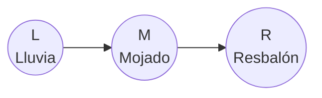
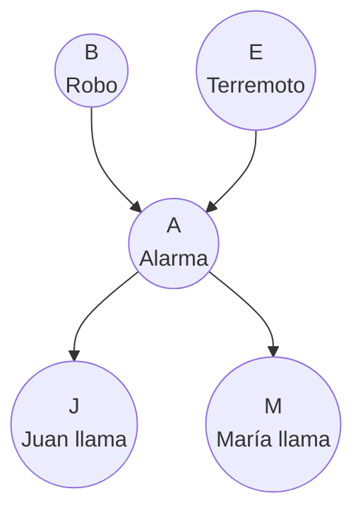
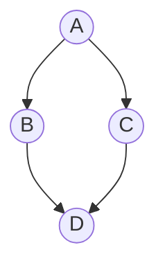
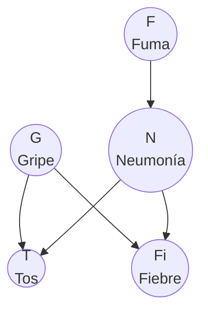
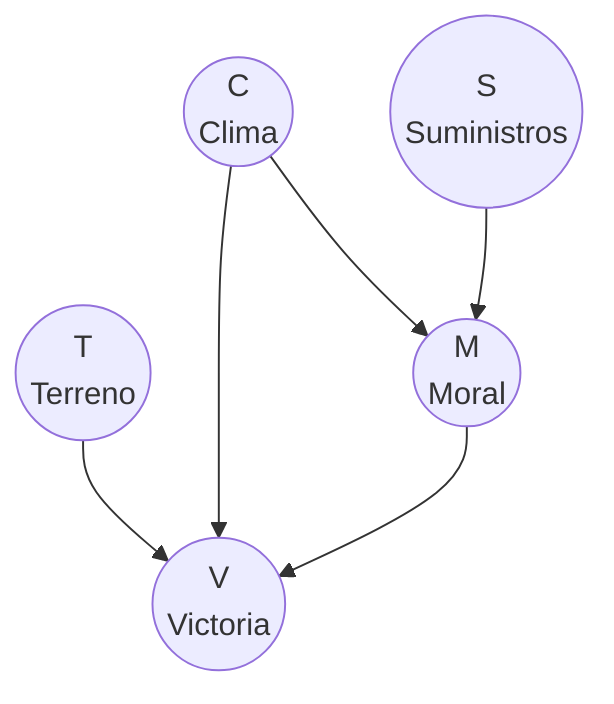
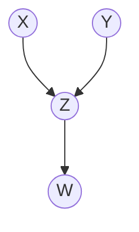

# De Probabilidades a Grafos

> *"The purpose of computing is insight, not numbers."*
> — Richard Hamming

---

## Recordatorio: las reglas de probabilidad

Antes de conectar probabilidades con grafos, necesitamos tener frescas las reglas fundamentales. Todo lo que haremos en redes Bayesianas se construye sobre estas cuatro reglas.

### 1. Regla del producto (product rule)

La probabilidad de que dos eventos ocurran **juntos** se descompone así:

$$P(A, B) = P(A \mid B) \cdot P(B)$$

**En palabras:** la probabilidad de $A$ y $B$ es la probabilidad de $B$ multiplicada por la probabilidad de $A$ dado que $B$ ya ocurrió.

**Ejemplo:** ¿Cuál es la probabilidad de que llueva **y** el piso esté mojado?

$$P(\text{Lluvia}, \text{Mojado}) = P(\text{Mojado} \mid \text{Lluvia}) \cdot P(\text{Lluvia})$$

### 2. Regla de la suma (sum rule / marginalización)

Si queremos la probabilidad de $A$ sola (sin importar $B$), sumamos sobre todos los valores posibles de $B$:

$$P(A) = \sum_{b} P(A, B = b)$$

**En palabras:** para obtener la probabilidad de $A$, sumamos la conjunta $P(A, B)$ sobre todos los valores posibles de $B$. A esto se le llama **marginalizar** $B$.

**Ejemplo:** ¿Cuál es la probabilidad de que el piso esté mojado (sin importar si llovió o no)?

$$P(\text{Mojado}) = P(\text{Mojado}, \text{Lluvia}) + P(\text{Mojado}, \text{NoLluvia})$$

### 3. Probabilidad condicional

Es la probabilidad de $A$ **sabiendo** que $B$ ocurrió:

$$P(A \mid B) = \frac{P(A, B)}{P(B)}$$

**En palabras:** la condicional es la conjunta dividida entre la marginal.

### 4. Teorema de Bayes

Invierte la dirección de la condicional:

$$P(B \mid A) = \frac{P(A \mid B) \cdot P(B)}{P(A)}$$

**En palabras:** si sabemos $P(A \mid B)$ (la probabilidad de $A$ dado $B$), podemos calcular $P(B \mid A)$ (la probabilidad de $B$ dado $A$) usando la prior $P(B)$ y la evidencia $P(A)$.

---

## El problema: la distribución conjunta es enorme

Imagina que tienes $n$ variables binarias (cada una vale 0 o 1). Un “mundo posible” es una asignación completa de valores, por ejemplo:

$$X_1=0,\; X_2=1,\; \ldots,\; X_n=0$$

Como cada variable tiene 2 valores, el número de asignaciones posibles (combinaciones) es $2^{n}$. La distribución conjunta

$$P(X_1, X_2, \ldots, X_n)$$

debe asignar una probabilidad a **cada** asignación, es decir, a cada término $P(X_1=x_1,\ldots,X_n=x_n)$.

| $n$ variables binarias | Asignaciones posibles ($2^{n}$) |
|:---------:|:--------------------:|
| 5 | 32 |
| 10 | 1,024 |
| 20 | 1,048,576 |
| 30 | 1,073,741,824 |

Así, con 30 variables binarias, la tabla de la conjunta tendría **más de mil millones** de probabilidades. Esto es inviable.

**La pregunta clave:** ¿Podemos representar la conjunta de forma más compacta?

---

## La idea central: factorización

La regla del producto nos permite **descomponer** una conjunta en piezas más pequeñas. Aplicándola repetidamente (regla de la cadena):

$$P(X_1, X_2, X_3) = P(X_3 \mid X_1, X_2) \cdot P(X_2 \mid X_1) \cdot P(X_1)$$

Esto siempre es cierto, para **cualquier** distribución. Pero hasta aquí no hemos ganado nada — el número total de parámetros es el mismo.

El truco viene cuando algunas variables **no dependen directamente** de todas las demás. Por ejemplo, si $X_3$ solo depende de $X_2$ (no de $X_1$):

$$P(X_3 \mid X_1, X_2) = P(X_3 \mid X_2)$$

Entonces la factorización se simplifica:

$$P(X_1, X_2, X_3) = P(X_3 \mid X_2) \cdot P(X_2 \mid X_1) \cdot P(X_1)$$

Cada factor ahora tiene **menos** variables de las que condiciona. Esto reduce drásticamente el número de parámetros que necesitamos almacenar.

---

## De factorización a grafo

Aquí viene la conexión visual. Cada factor $P(X_i \mid \text{padres de } X_i)$ se representa como:
- Un **nodo** para $X_i$
- Una **flecha** desde cada padre hacia $X_i$

La regla es simple:

> **Flecha de $A$ a $B$** significa que $B$ depende directamente de $A$, es decir, $A$ aparece en la condicional $P(B \mid \ldots, A, \ldots)$.

### Ejemplo: la cadena Lluvia → Mojado → Resbalón

Supongamos tres variables:
- **L** = Lluvia (llueve o no llueve)
- **M** = Piso Mojado (el piso está mojado o no)
- **R** = Resbalón (me resbalo o no)

La factorización natural es:

$$P(L, M, R) = P(R \mid M) \cdot P(M \mid L) \cdot P(L)$$

¿Por qué esta factorización? Porque:
- La lluvia ocurre o no independientemente (es la "causa raíz")
- El piso se moja **dependiendo de** si llueve
- Me resbalo **dependiendo de** si el piso está mojado (no directamente de si llueve)

El grafo correspondiente:

**Lectura del grafo:**
- $L$ no tiene padres → su factor es $P(L)$ (la prior)
- $M$ tiene un padre ($L$) → su factor es $P(M \mid L)$
- $R$ tiene un padre ($M$) → su factor es $P(R \mid M)$

La conjunta completa es el **producto de todos los factores**:

$$P(L, M, R) = P(L) \cdot P(M \mid L) \cdot P(R \mid M)$$

### La regla general

Para una red Bayesiana con variables $X_1, \ldots, X_n$:

$$\boxed{P(X_1, X_2, \ldots, X_n) = \prod_{i=1}^{n} P(X_i \mid \text{Padres}(X_i))}$$

Donde $\text{Padres}(X_i)$ son los nodos que tienen flechas **hacia** $X_i$ en el grafo.

Si un nodo no tiene padres, su factor es simplemente $P(X_i)$ (una probabilidad marginal).

---

## Del grafo a probabilidades: paso a paso

Dado un grafo dirigido acíclico (DAG), podemos escribir la distribución conjunta siguiendo este procedimiento:

**Paso 1:** Para cada nodo, identifica sus padres (los nodos con flechas que llegan a él).

**Paso 2:** Escribe el factor $P(\text{nodo} \mid \text{padres})$.

**Paso 3:** La conjunta es el producto de todos los factores.

:::example{title="Ejemplo: Alarma de Sherlock Holmes"}
Imagina el siguiente escenario clásico:
- Un **robo** ($B$, de *burglary*) o un **terremoto** ($E$) pueden activar la **alarma** ($A$) de una casa.
- Si la alarma suena, **Juan** ($J$) o **María** ($M$) podrían llamar al dueño.

**Paso 1 — Identificar padres:**

| Nodo | Padres |
|------|--------|
| $B$ | ninguno |
| $E$ | ninguno |
| $A$ | $B$, $E$ |
| $J$ | $A$ |
| $M$ | $A$ |

**Paso 2 — Escribir factores:**

| Nodo | Factor |
|------|--------|
| $B$ | $P(B)$ |
| $E$ | $P(E)$ |
| $A$ | $P(A \mid B, E)$ |
| $J$ | $P(J \mid A)$ |
| $M$ | $P(M \mid A)$ |

**Paso 3 — Conjunta:**

$$P(B, E, A, J, M) = P(B) \cdot P(E) \cdot P(A \mid B, E) \cdot P(J \mid A) \cdot P(M \mid A)$$

**¿Cuánto ahorramos?** Sin la red, la conjunta de 5 variables binarias necesita $2^5 - 1 = 31$ parámetros. Con la red:

| Factor | Parámetros |
|--------|:----------:|
| $P(B)$ | 1 |
| $P(E)$ | 1 |
| $P(A \mid B, E)$ | 4 |
| $P(J \mid A)$ | 2 |
| $P(M \mid A)$ | 2 |
| **Total** | **10** |

De 31 a 10 parámetros — una reducción de más de 3x. Y la ganancia crece exponencialmente con más variables.
:::

---

## De probabilidades a grafo: paso a paso

También podemos ir en la dirección inversa. Dada una factorización, construir el grafo.

**Paso 1:** Cada variable es un nodo.

**Paso 2:** Para cada factor $P(X_i \mid Y_1, \ldots, Y_k)$, dibuja una flecha desde cada $Y_j$ hacia $X_i$.

**Paso 3:** Verifica que el grafo resultante sea un **DAG** (grafo dirigido acíclico — sin ciclos).

:::example{title="De factorización a grafo"}
Dada la factorización:

$$P(A, B, C, D) = P(A) \cdot P(B \mid A) \cdot P(C \mid A) \cdot P(D \mid B, C)$$

**Paso 1:** Nodos: $A$, $B$, $C$, $D$.

**Paso 2:**
- $P(A)$: $A$ no tiene padres
- $P(B \mid A)$: flecha de $A$ a $B$
- $P(C \mid A)$: flecha de $A$ a $C$
- $P(D \mid B, C)$: flechas de $B$ y $C$ a $D$

**Paso 3:** ¿Hay ciclos? No. Es un DAG válido.
:::

---

## Requisitos de una red Bayesiana

Una red Bayesiana es un par $(G, \Theta)$ donde:

1. **$G$** es un **grafo dirigido acíclico** (DAG). No puede tener ciclos, porque un ciclo significaría que una variable se causa a sí misma (circular).

2. **$\Theta$** son las **tablas de probabilidad condicional** (CPTs): para cada nodo, una tabla que especifica $P(\text{nodo} \mid \text{padres})$.

Juntos, $G$ y $\Theta$ definen una distribución conjunta completa sobre todas las variables.

**Importante — la dirección de las flechas:**

Las flechas representan **dependencia directa**, que frecuentemente (pero no siempre) coincide con causalidad. En los ejemplos anteriores:
- Lluvia **causa** que el piso se moje → $L \to M$ (causal)
- Un robo **causa** que suene la alarma → $B \to A$ (causal)

Sin embargo, una red Bayesiana es válida con **cualquier** orden topológico. Lo que importa es que la factorización sea correcta, no que las flechas representen causalidad. Dicho esto, modelar las flechas como relaciones causales produce redes más compactas y naturales.

---

## Ejemplo: Red de diagnóstico médico

Un paciente llega con tos. Queremos modelar las relaciones entre enfermedades y síntomas.

Variables:
- **F** = Fuma (sí/no)
- **G** = Gripe (sí/no)
- **N** = Neumonía (sí/no)
- **T** = Tos (sí/no)
- **Fi** = Fiebre (sí/no)

**Lectura de la red:**
- Fumar incrementa la probabilidad de neumonía: $F \to N$
- Tanto la gripe como la neumonía causan tos: $G \to T$ y $N \to T$
- Tanto la gripe como la neumonía causan fiebre: $G \to Fi$ y $N \to Fi$
- Fumar y gripe son independientes (no hay flecha entre ellos)

**Factorización:**

$$P(F, G, N, T, Fi) = P(F) \cdot P(G) \cdot P(N \mid F) \cdot P(T \mid G, N) \cdot P(Fi \mid G, N)$$

Nota cómo cada factor refleja exactamente las flechas del grafo.

---

## Ejemplo: Red de Campaña de Napoleón (simplificada)

Modelemos una versión simplificada de un sistema para predecir el resultado de una batalla (inspirado en los modelos estratégicos de software tipo Napoleon):

Variables:
- **T** = Terreno favorable (sí/no)
- **C** = Clima favorable (sí/no)
- **M** = Moral alta de las tropas (sí/no)
- **S** = Suministros suficientes (sí/no)
- **V** = Victoria (sí/no)

**Lectura:**
- El terreno influye directamente en la victoria
- El clima afecta tanto la moral como la victoria directamente
- Los suministros afectan la moral
- La moral de las tropas influye en la victoria

**Factorización:**

$$P(T, C, S, M, V) = P(T) \cdot P(C) \cdot P(S) \cdot P(M \mid C, S) \cdot P(V \mid T, C, M)$$

Tres variables raíz ($T$, $C$, $S$) sin padres, una variable intermedia ($M$) y una variable objetivo ($V$).

---

## Resumen: el diccionario probabilidad ↔ grafo

| Concepto en probabilidad | Concepto en el grafo |
|--------------------------|---------------------|
| Variable aleatoria $X_i$ | Nodo |
| $P(X_i \mid \text{Padres})$ | Nodo con flechas entrantes |
| $P(X_i)$ (sin condicionar) | Nodo sin padres (nodo raíz) |
| $\prod_i P(X_i \mid \text{Padres}(X_i))$ | Todo el grafo |
| Regla del producto | Cada flecha |
| Marginalización $\sum_B P(A, B)$ | "Ignorar" un nodo |
| Teorema de Bayes | Invertir la dirección de inferencia |

---

:::exercise{title="Ejercicio: Traduce entre probabilidades y grafos"}

**Parte A — Del grafo a probabilidades:**

Dado el siguiente grafo:

1. ¿Cuáles son los padres de cada nodo?
2. Escribe la factorización de $P(X, Y, Z, W)$.
3. Si todas las variables son binarias, ¿cuántos parámetros necesitas? ¿Cuántos necesitarías sin la red?

**Parte B — De probabilidades a grafo:**

Dada la factorización:

$$P(A, B, C, D, E) = P(A) \cdot P(B) \cdot P(C \mid A, B) \cdot P(D \mid C) \cdot P(E \mid C)$$

1. Dibuja el grafo dirigido correspondiente.
2. ¿Cuáles son los nodos raíz?
3. ¿Cuáles son los nodos hoja (sin hijos)?

**Parte C — Identificación de reglas:**

Para cada paso, identifica qué regla de probabilidad se está usando:

- $P(L, M) = P(M \mid L) \cdot P(L)$ → ¿qué regla?
- $P(M) = P(M, L) + P(M, \neg L)$ → ¿qué regla?
- $P(L \mid M) = \frac{P(M \mid L) \cdot P(L)}{P(M)}$ → ¿qué regla?

:::

<strong>Ver Respuestas</strong>

**Parte A:**

1. Padres: $X$ → ninguno, $Y$ → ninguno, $Z$ → {$X$, $Y$}, $W$ → {$Z$}

2. $P(X, Y, Z, W) = P(X) \cdot P(Y) \cdot P(Z \mid X, Y) \cdot P(W \mid Z)$

3. Parámetros con la red:
   - $P(X)$: 1 parámetro
   - $P(Y)$: 1 parámetro
   - $P(Z \mid X, Y)$: $2 \times 2 = 4$ parámetros (una probabilidad por cada combinación de $X$, $Y$)
   - $P(W \mid Z)$: 2 parámetros
   - **Total: 8 parámetros**
   - Sin la red: $2^4 - 1 = 15$ parámetros

**Parte B:**

1. Grafo:
   - $A$ → $C$, $B$ → $C$, $C$ → $D$, $C$ → $E$
2. Nodos raíz: $A$ y $B$
3. Nodos hoja: $D$ y $E$

**Parte C:**

- $P(L, M) = P(M \mid L) \cdot P(L)$ → **Regla del producto**
- $P(M) = P(M, L) + P(M, \neg L)$ → **Regla de la suma (marginalización)**
- $P(L \mid M) = \frac{P(M \mid L) \cdot P(L)}{P(M)}$ → **Teorema de Bayes**

---

**Siguiente:** [Queries y Tablas de Probabilidad →](02_queries_y_tablas.md)
