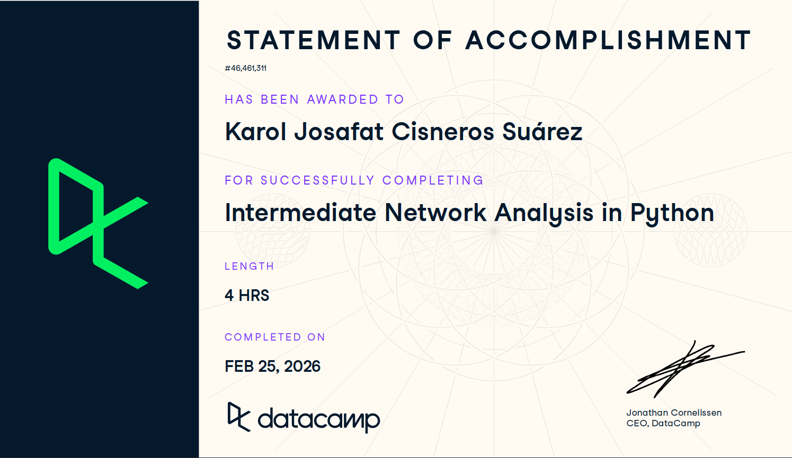

# Plantilla de Entrega

Esta es la plantilla que debes copiar a tu carpeta `estudiantes/tu_usuario/certificaciones/` para entregar la evidencia del curso.

**Curso:** [Intermediate Network Analysis in Python](https://app.datacamp.com/learn/courses/intermediate-network-analysis-in-python)

**Requisitos de la evidencia:**
1. El nombre del curso
2. El progreso al 100%
3. Tu usuario logueado

---

# Evidencia: Intermediate Network Analysis in Python

Nombre del Estudiante: Karol Josafat Cisneros Suárez
Fecha: 23 de febrero de 2026

## Prueba de Finalización

Por favor, inserta aquí abajo una captura de pantalla clara donde se vea:
1.  El nombre del curso.
2.  El progreso al 100%.
3.  Tu usuario logueado.

o enlace al certificado público:
[Pegar Link Aquí]
